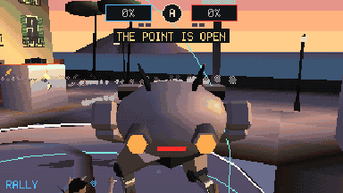
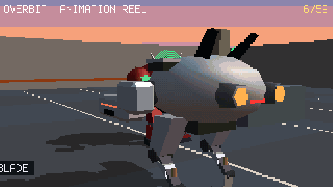
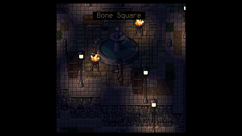
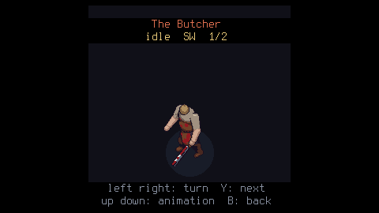

# bm — BareMetal

<p align="center">
  
</p>
<p align="center"><sub><b>A game from scratch, with bm alone</b> (30 s): pixel art and a 3D model in bm Studio, skeleton
and walk in bm Animator, then on the console the map in the SDK, the code in bm Code with the AI assistant,
and the game. The console scenes are recorded in QEMU (<code>-M raspi0</code>) with the same kernel as the Pi.
<a href="docs/showreel.mp4">MP4 1280×720</a> · rebuilt by <code>make showreel</code></sub></p>

**bm** is a games console that runs on a **Raspberry Pi Zero W** (and Zero 2 W) with no operating system.
The kernel boots straight from the SD card into a menu of games. Games are written in
Lua, with 2D and 3D graphics, sound and up to four controllers. The tools to make them
are part of bm: some run on the PC, others on the console itself.

## 1. What bm is

- **One program on the SD card.** `kernel.img` (~2 MB of C, ARM assembly and Lua 5.4)
  drives the hardware itself:
  - HDMI video, and audio through HDMI;
  - USB keyboards, gamepads and mice;
  - Bluetooth: up to 4 DualShock 4 pads, BLE keyboards and mice (LE or classic);
  - a mouse pointer in the menu, and in the games that ask for it (the right stick of a
    pad moves it too);
  - WiFi with HTTPS, Ethernet on the Pi 1 B;
  - the SD card, read and written as FAT32.
- **Games are `.bm` cartridges.** One file holds the Lua code, sprite sheet, tile map,
  3D models, skeletal animations, sound bank and cover. Drop it in `carts/` and it shows
  up in the menu. Saves and settings go in `bm/` on the card.
- **Plays `.p8` carts too.** nano8, a built-in emulator, runs PICO-8-style `.p8` and
  `.p8.png` carts.
- **Same kernel for the Pi 1** (A, B, A+, B+), which has the same chip.
- **Pi Zero 2 W too:** its own build of the same sources, `kernel7.img` (ARMv7, 32-bit),
  sits next to `kernel.img` on the same SD card; the Pi's firmware starts the right one.

Why bare metal instead of Linux:

- **On in about 2 seconds:** power on and the menu is there. There is nothing to log
  into, update or configure.
- **The whole machine belongs to the game.** No scheduler, background services or
  window system share the one 1 GHz core and 448 MiB of RAM. Input goes straight from
  the USB and Bluetooth drivers to the game. Each frame is 16.7 ms, all for the game.
- **No PC needed to make games.** You can write the code, draw the sprites, build the map,
  compose the music and make 3D models on the console, then play the result.
- **Small, and all here.** Every driver, from USB and Bluetooth to WiFi and the 3D
  rasterizer, is in this repository. The only third-party libraries are Lua, lwIP and
  mbedTLS.

```lua
local x = 320
function _update()                       -- 60 times a second
  if btn(0) then x = x - 2 end           -- left
  if btn(1) then x = x + 2 end           -- right
end
function _draw()
  cls(0x102030)
  spr(1, x, 180)                         -- a sprite from the sheet
end
```

## 2. Performance

Hardware of the **Raspberry Pi Zero W**:

- CPU: ARM1176JZF-S, one ARMv6 core. It starts at 700 MHz and bm raises it to **1 GHz**.
- Cache: 16 KiB L1 for instructions + 16 KiB for data.
- RAM: 512 MiB, of which **448 MiB** go to the ARM.
- Memory bandwidth, measured: memcpy ~100 MB/s, fill ~430 MB/s. This is the real
  limit.
- GPU: VideoCore IV. Its scaler enlarges the 640×360, 480×270 or 320×180 picture (or a
  256×256 square in the middle) to 720p or 1080p for free, and our own small V3D driver draws the 3D of the games: the
  ARM transforms, lights and clips, the GPU fills the pixels (811 Mpixel/s measured).
  Without it (QEMU, or `gpu3d=0`) the ARM rasterizer draws.

Measured **on the Pi**: the most objects per frame, from the stress test
([docs/STRESS.md](docs/STRESS.md)), at 640×360 in RGB565.

| | 60 fps | 30 fps |
|---|---:|---:|
| 16×16 sprites (C) | **4482** | 9255 |
| 32×32 sprites (C) | **1513** | 3130 |
| 2D triangles, ~170 px each | **2594** | 5368 |
| 3D triangles (z-buffer, lighting), ARM rasterizer, September | **1195** | 5011 |
| 3D triangles (spheres), ARM rasterizer after its M33 rewrite | **2700** | 8914 |
| 3D triangles (spheres), drawn by the GPU | **7142** | 15346 |
| 16×16 sprites, one `spr()` call each from Lua | **1829** | 3774 |
| 3D triangles, `draw3d()` called from Lua | **1115** | 4692 |

Real games on the Pi:

- **Astro Wing** (3D flight) takes 6.3 ms per frame and runs at 60 fps.
- **Titan Clash** (2D fighting, large sprites) takes 11.6 ms and runs at 60 fps.
- **Texture Room** runs at 60 fps with 456 textured triangles and 60 516 textured pixels;
  at 640×360 with 32 crates it takes 5.8 ms with the GPU against 25–26 ms on the ARM.
- **Chaos Kitchen** with the GPU: 6.8 ms per frame (14.1 ms before).
- A simple Lua operation costs about 100 ns.

More: [docs/PRESTAZIONI.md](docs/PRESTAZIONI.md) (choices, expected against measured)
and [docs/HARDWARE.md](docs/HARDWARE.md).

## 3. Tools made for bm

Everything a cartridge contains is made with bm's own tools. They read and write the
`.bm` file directly, even on the SD card.

**On the PC:** web pages with no install. Open `sdk/studio/index.html` or
`sdk/animator/index.html`, or run `make studio`. Guide: [sdk/README.md](sdk/README.md).

- **bm Studio**:
  - 3D models built from tiles: lay tiles of the sprite
    sheet on a grid, stack blocks, drag corners into roofs and ramps, paint on the model;
  - the pixel art of the sprite sheet;
  - import and export of `.glb` and `.png`.
- **bm Animator**:
  - skeletons and skinning;
  - keyframe animations on a timeline, played on the console by `animate(m, "walk", t)`;
  - 3D animations rendered into sprites, in 1 to 8 directions.

<p align="center">
  
  
  
  
</p>

**On the console**, in the Dev tab, with a keyboard or a gamepad:

- **bm SDK**: the hub of a project. A new game from a template (platformer, top-down,
  shooter, 3D scene, 3D with models), the code, the sprites and the map, the 3D models and
  animations turning with the code to draw them, and the rest of the suite (bm Code,
  Pixel, Studio, Animator, Mesh, Sound) one key away on the same file, with a way back.
  Its dev kit shows the tokens, the memory of the game's data, the file against the 8 MiB
  of the future `.b16` cartridge, and the fps, ms and RAM of the last try; the assistant
  (F6) guides you through making a 2D or a 3D game step by step.
- **bm Code**: the code editor, with tabs, two pages side by side and a small sharp
  6×12 font. While you type a word it shows the rest of the likeliest one and Tab writes
  it: Lua and the API in the code, Italian or English in comments, the assistant's
  questions in `#entry:` lines ([docs/PREDICT.md](docs/PREDICT.md)).
- **AI assistant**: a small INT8 network that runs on the Pi. It answers questions about
  the API and error messages, comments code, sketches sprites and, in bm Studio and bm
  Animator (F6), builds low-poly 3D models from words: shapes, objects, people, animals
  and machines, the characters with a skeleton and animations. Its knowledge base is in
  Italian for now. On the PC, `tools/img2mesh.py` turns a picture into such a model
  through the Claude API: the model writes the parts, sees them rendered and corrects them;
  `tools/meshy2mesh.py` does the same through Meshy's image-to-3D. The console does it by
  itself too: bm Studio's models page sends a picture from the SD card to the service and
  takes the model back, texture and all (a key in `bm/config.txt`; the services are a
  table, Meshy first), or makes one by itself from the picture's outline, cut out with some
  thickness or turned on a lathe, with no network at all. A polygon reducer (quadric edge collapse, in the kernel and in
  `tools/bmreduce.py`) fits any model to the Pi's 1200 triangles, keeping borders, colour
  lines, texture seams and the skeleton.
- **Sound editor**: an 8-voice synthesizer, sound effects and music patterns for the
  cartridge's sound bank.
- **bm Studio** and **bm Animator**: the PC programs' twins, on the same files. bm Studio
  builds models with blocks and tiles, chooses, moves, turns and copies faces, moves
  corners and paints the tiles right on the model. bm Animator plays the models, makes
  their skeletons and skin, animates them on a timeline and draws an animation into the
  sprite sheet.
- **bm Mesh**: the vertices and faces of every mesh, including the ones the game's code
  builds.
- **bm Pixel**: the sprite sheet's pixel art. It has drawing tools, a palette of up to 256
  colours and frame animation with onion skin.

<p align="center">
  
  
  
  
  
  
  
</p>

## 4. What you can make

2D and 3D games in `.bm` cartridges: tile maps and sprites, lights, textured 3D with
z-buffer and Gouraud shading, skeletal animation, music and sound effects, saves, and
local multiplayer for up to 4 players. The games on the card, all `.bm`:

<p align="center">
  
  <br><sub><b>Overbit</b>: a hero shooter in first person at 480×270 (up to 1080p on the GPU), made for 60 fps on a Pi Zero.
  A Control match on <b>Partenope</b>, the waterfront of a future Naples at sunset, ten bots on the point;
  <a href="docs/img/overbit-match.mp4">MP4 with sound</a> · <code>make overbit-reel-match</code></sub>
</p>

<p align="center">
  
  <br><sub>The ultimates of Kaiju, Sarge, Frost, Fuse, Rail, Orbit and Akari; the whole reel,
  <a href="docs/img/overbit-reel-heroes.mp4">MP4 with sound</a> · <code>make overbit-reel-heroes</code></sub>
</p>

<p align="center">
  
  <br><sub>Rally's animation reel, <a href="docs/img/overbit-reel-rally.mp4">MP4 with sound</a> · <code>make overbit-reel</code></sub>
</p>

<p align="center">
  
  
  
  
  
  
  
  
</p>

- **Overbit** (M38, to be tried on the Pi): a hero shooter in 3D, first person, 8 heroes with the
  kits of Overwatch's (our own names and looks): the tanks **Rally** and **Kaiju** (two
  mechs with their pilots), **Sarge**, **Frost**, **Fuse** and **Rail** for damage, the
  supports **Orbit** and **Akari**; the map **Partenope** (light baked in, textured
  facades) and the **Control** mode, 5 against 5; bots with our own small INT8 network
  for their tactics, trained on the PC by letting them play; **online** matches for up to
  10 consoles (lockstep over UDP, on the LAN or through a small relay); a training range,
  the reels, and a benchmark where the bots play the same match on the ARM and on the GPU
  at every quality. With the GPU (shadows, smooth light, MSAA) the ARM does 23–32% less
  work a frame than before in the heaviest fight: numbers and limits in
  [`docs/M33-PRIMA-DOPO.md`](docs/M33-PRIMA-DOPO.md).
- **Astro Wing**: 3D flight.
- **Titan Clash**: giant robots fighting, against the CPU or two players.
- **Chaos Kitchen**: co-op cooking in 3D for 1 to 4 players.
- **Studio Village**: bm Studio models and a villager animated with bm Animator.
- **Texture Room**: a 3D room, all textured.
- **Hunter's Night**: gothic 2D at 320×180, with lights.
- **Yharnam**: an endless gothic town at night, at 256×256: the streets are made while you
  walk, lit as in Dank Tomb (light levels and fade tables), with fires and warm lamps. The
  hunter has 27 animations in 8 directions: saw cleaver combos (folded and opened), the
  pistol, backstep, hurt, knocked down, death. Twelve creatures roam the districts (mad
  townsfolk, beasts, hunters, eldritch horrors) and four bosses wait in theirs, each with
  two special attacks and two combos. The fight is Bloodborne's: stamina, quickstep and roll
  with i-frames, lock-on, charged blows, the trick weapon transformed mid-combo, the gun
  parry and the visceral attack, the rally. The town is walked area by area, each closed by
  mist and ended by its boss, with two hunter's lamps to light; blood echoes from the slain
  are dear: a little healing, a death, and at most four paths taken at the lamps, which shape
  how the hunter fights.
- The rest: Pong (2 players), Snake, Star Shooter, and **nano8** for `.p8` carts.

**The Market**, the first tab of the menu, downloads free games from
[f-accomando/bm-market](https://github.com/f-accomando/bm-market): a catalog signed with the
market's key, every file checked with its SHA-256 before it touches the SD card. Games are
published with a pull request there, also from the console with a GitHub token, and sent
between consoles on the home network. The games of the project are all in it (details in
Italian in [README_OLD.md](README_OLD.md#market-m25)).

The console screenshots come from QEMU (`tests/qemu_test.py --shots DIR`). The bm Studio
and bm Animator ones come from `make test-studio-ui` and `make showreel`.

To write a game, see the guide [docs/GAME-GUIDE.md](docs/GAME-GUIDE.md) and the reference
[docs/API.md](docs/API.md), with the shared game library `require "bmlib"` and the network
library `require "bmnet"`. Both are
also in Italian ([docs/GUIDA-GIOCHI.md](docs/GUIDA-GIOCHI.md), [docs/API-IT.md](docs/API-IT.md)),
like the rest of the documentation.

## Quick start

```sh
make firmware && make image      # dist/bm.img: firmware, kernel and games
make test                        # tests on the PC and end to end in QEMU
```

1. Write `dist/bm.img` to a microSD card with Raspberry Pi Imager ("Use custom"),
   balenaEtcher or `dd`.
2. Connect HDMI and a USB keyboard or gamepad. The keyboard or gamepad needs an OTG
   adapter on the middle micro-USB port.
3. Power on.

Needs `arm-none-eabi-gcc`, Python 3, `dosfstools` and `mtools`, plus QEMU for the tests.

- The full documentation, in Italian: [README_OLD.md](README_OLD.md). It covers the
  monitor, keys, network, releases, the Pi 1, the Pi Zero 2 W, the source layout and
  technical notes.
- The plan: [docs/ROADMAP.md](docs/ROADMAP.md).

## License

bm is by F. Accomando and is released under the **BM Community License 1.0**
([`LICENSE`](LICENSE)).

- Individuals may use, modify and redistribute it freely, including commercially on
  their own account.
- Attribution is required.
- Modified versions must publish their source under the same license.
- Organisations need a separate commercial license.

Third-party components keep their own licenses: Lua (MIT), lwIP (BSD), mbedTLS
(Apache 2.0) and the Mozilla root certificates. They are listed in
[README_OLD.md](README_OLD.md#licenza).
