# bm — BareMetal

<p align="center">
  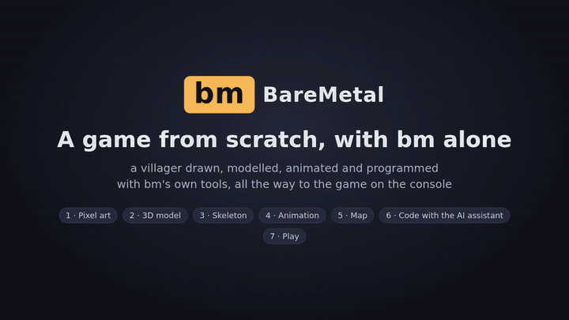
</p>
<p align="center"><sub><b>A game from scratch, with bm alone</b> (30 s): pixel art and a 3D model in bm Studio, skeleton
and walk in bm Animator, then on the console the map in the SDK, the code in bm Code with the AI assistant,
and the game. The console scenes are recorded in QEMU (<code>-M raspi0</code>) with the same kernel as the Pi.
<a href="docs/showreel.mp4">MP4 1280×720</a> · rebuilt by <code>make showreel</code></sub></p>

**bm** is a games console that runs on a **Raspberry Pi Zero W** with no operating system.
The kernel boots straight from the SD card into a menu of games. Games are written in
Lua, with 2D and 3D graphics, sound and up to four controllers. The tools to make them
are part of bm: some run on the PC, others on the console itself.

## 1. What bm is

- **One program on the SD card.** `kernel.img` (~2 MB of C, ARM assembly and Lua 5.4)
  drives the hardware itself:
  - HDMI video, and audio through HDMI;
  - USB keyboards and gamepads;
  - Bluetooth: up to 4 DualShock 4 pads, and BLE keyboards;
  - WiFi with HTTPS, Ethernet on the Pi 1 B;
  - the SD card, read and written as FAT32.
- **Games are `.bm` cartridges.** One file holds the Lua code, sprite sheet, tile map,
  3D models, skeletal animations, sound bank and cover. Drop it in `carts/` and it shows
  up in the menu. Saves and settings go in `bm/` on the card.
- **Plays `.p8` carts too.** nano8, a built-in emulator, runs PICO-8-style `.p8` and
  `.p8.png` carts.
- **Same kernel for the Pi 1** (A, B, A+, B+), which has the same chip.

Why bare metal instead of Linux:

- **On in about 2 seconds:** power on and the menu is there. There is nothing to log
  into, update or configure.
- **The whole machine belongs to the game.** No scheduler, background services or
  window system share the one 1 GHz core and 448 MiB of RAM. Input goes straight from
  the USB and Bluetooth drivers to the game. Each frame is 16.7 ms, all for the game.
- **No PC needed to make games.** You can write the code, draw the sprites, build the map,
  compose the music and make 3D models on the console, then play the result.
- **Small, and all here.** Every driver, from USB and Bluetooth to WiFi and the 3D
  rasterizer, is in this repository. The only third-party libraries are Lua, lwIP and
  mbedTLS.

```lua
local x = 320
function _update()                       -- 60 times a second
  if btn(0) then x = x - 2 end           -- left
  if btn(1) then x = x + 2 end           -- right
end
function _draw()
  cls(0x102030)
  spr(1, x, 180)                         -- a sprite from the sheet
end
```

## 2. Performance

Hardware of the **Raspberry Pi Zero W**:

- CPU: ARM1176JZF-S, one ARMv6 core. It starts at 700 MHz and bm raises it to **1 GHz**.
- Cache: 16 KiB L1 for instructions + 16 KiB for data.
- RAM: 512 MiB, of which **448 MiB** go to the ARM.
- Memory bandwidth, measured: memcpy ~100 MB/s, fill ~430 MB/s. This is the real
  limit.
- GPU: VideoCore IV. bm uses only its scaler, which enlarges the 640×360 or 320×180
  picture to 720p or 1080p for free. The 3D is drawn in software on the ARM.

Measured **on the Pi**: the most objects per frame, from the stress test
([docs/STRESS.md](docs/STRESS.md)), at 640×360 in RGB565.

| | 60 fps | 30 fps |
|---|---:|---:|
| 16×16 sprites (C) | **4482** | 9255 |
| 32×32 sprites (C) | **1513** | 3130 |
| 2D triangles, ~170 px each | **2594** | 5368 |
| 3D triangles drawn (z-buffer, lighting) | **1195** | 5011 |
| 16×16 sprites, one `spr()` call each from Lua | **1829** | 3774 |
| 3D triangles, `draw3d()` called from Lua | **1115** | 4692 |

Real games on the Pi:

- **Astro Wing** (3D flight) takes 6.3 ms per frame and runs at 60 fps.
- **Titan Clash** (2D fighting, large sprites) takes 11.6 ms and runs at 60 fps.
- **Texture Room** runs at 60 fps with 456 textured triangles and 60 516 textured pixels.
- A simple Lua operation costs about 100 ns.

More: [docs/PRESTAZIONI.md](docs/PRESTAZIONI.md) (choices, expected against measured)
and [docs/HARDWARE.md](docs/HARDWARE.md).

## 3. Tools made for bm

Everything a cartridge contains is made with bm's own tools. They read and write the
`.bm` file directly, even on the SD card.

**On the PC:** web pages with no install. Open `sdk/studio/index.html` or
`sdk/animator/index.html`, or run `make studio`. Guide: [sdk/README.md](sdk/README.md).

- **bm Studio**:
  - 3D models built from tiles, in the style of Crocotile 3D: lay tiles of the sprite
    sheet on a grid, stack blocks, drag corners into roofs and ramps, paint on the model;
  - the pixel art of the sprite sheet;
  - import and export of `.glb` and `.png`.
- **bm Animator**:
  - skeletons and skinning;
  - keyframe animations on a timeline, played on the console by `animate(m, "walk", t)`;
  - 3D animations rendered into sprites, in 1 to 8 directions.

<p align="center">
  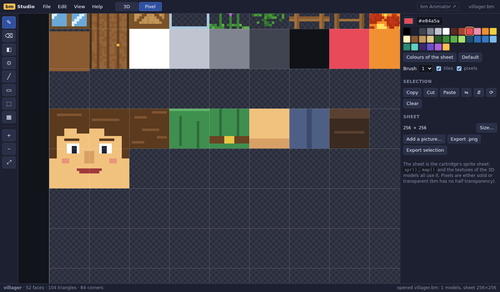
  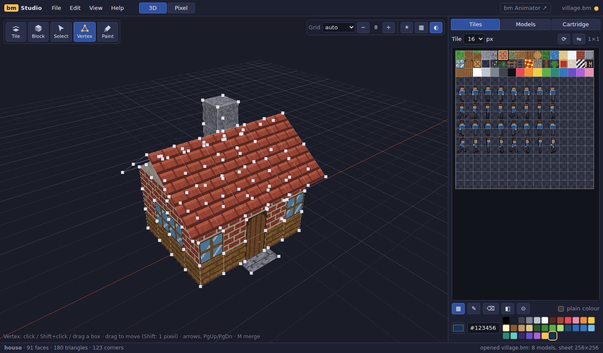
  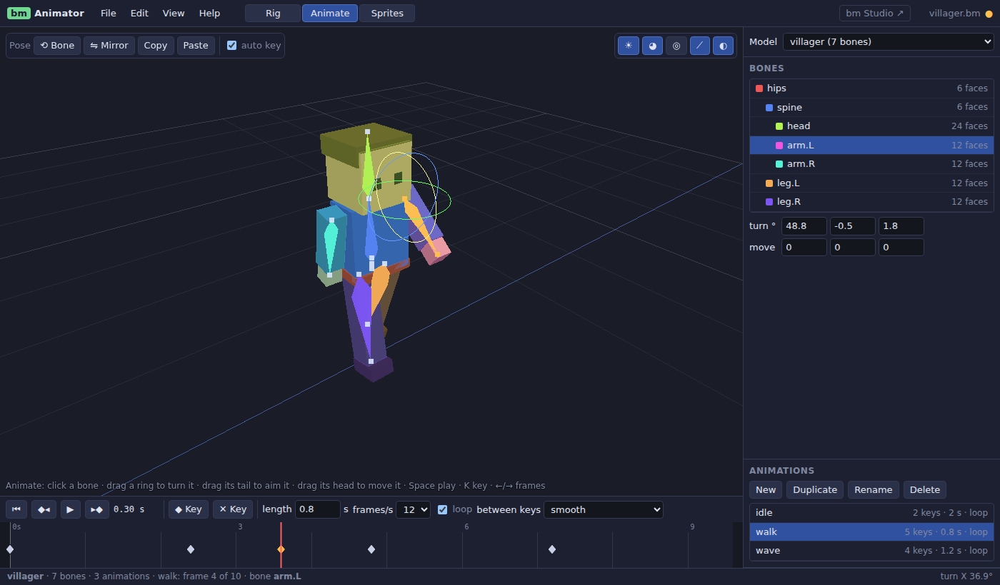
  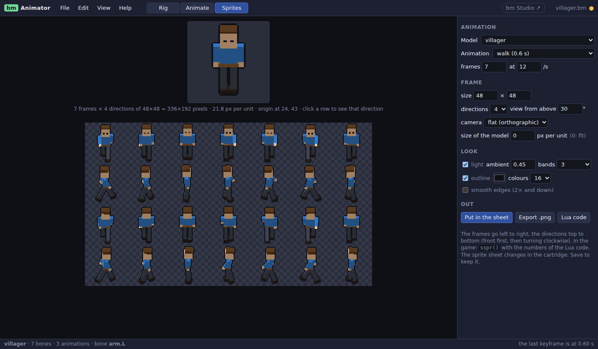
</p>

**On the console**, in the Dev tab, with a keyboard or a gamepad:

- **SDK**: code, sprites and map, try the game and come back to the editor.
- **bm Code**: the code editor, with tabs, two pages side by side and a small sharp
  6×12 font.
- **AI assistant**: a small INT8 network that runs on the Pi. It answers questions about
  the API and error messages, comments code, and sketches sprites. Its knowledge base is
  in Italian for now.
- **Sound editor**: an 8-voice synthesizer, sound effects and music patterns for the
  cartridge's sound bank.
- **bm Studio** and **bm Animator**: the PC programs' twins, on the same files. bm Studio
  builds models with blocks and tiles, chooses, moves, turns and copies faces, moves
  corners and paints the tiles right on the model. bm Animator plays the models, makes
  their skeletons and skin, animates them on a timeline and draws an animation into the
  sprite sheet.
- **bm Mesh**: the vertices and faces of every mesh, including the ones the game's code
  builds.
- **bm Pixel**: the sprite sheet's pixel art. It has drawing tools, a palette of up to 256
  colours and frame animation with onion skin.

<p align="center">
  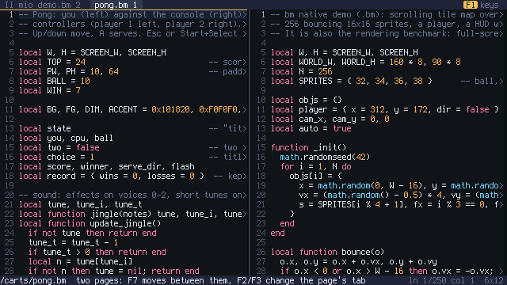
  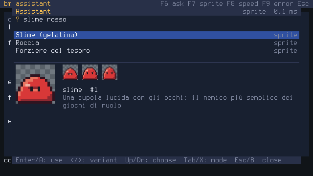
  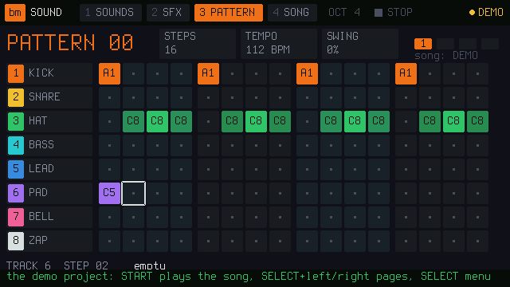
  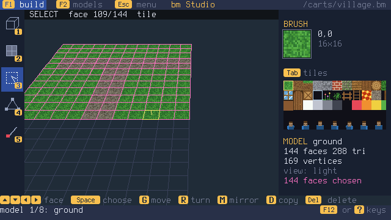
  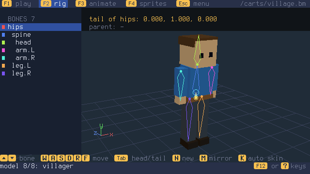
  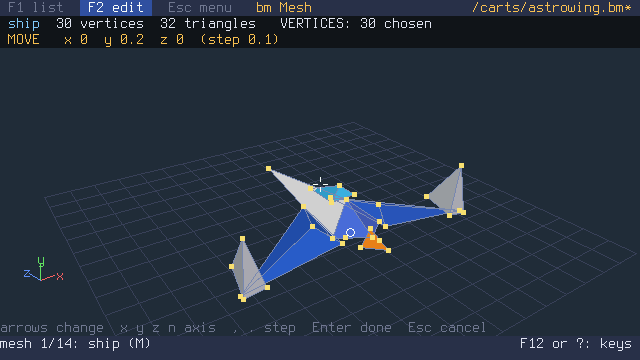
  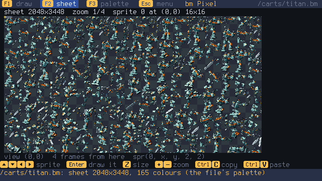
</p>

## 4. What you can make

2D and 3D games in `.bm` cartridges: tile maps and sprites, lights, textured 3D with
z-buffer and Gouraud shading, skeletal animation, music and sound effects, saves, and
local multiplayer for up to 4 players. The games on the card, all `.bm`:

<p align="center">
  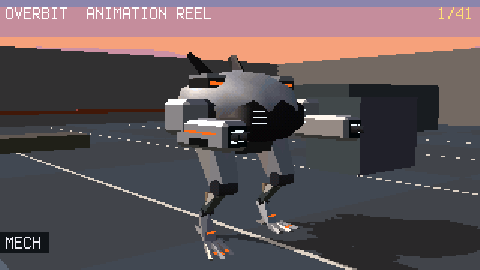
  <br><sub><b>Overbit</b> (in progress): a hero shooter in first person at 320×180, 60 fps on a Pi Zero.
  Rally's animation reel, <a href="docs/img/overbit-reel-rally.mp4">MP4 with sound</a> · <code>make overbit-reel</code></sub>
</p>

<p align="center">
  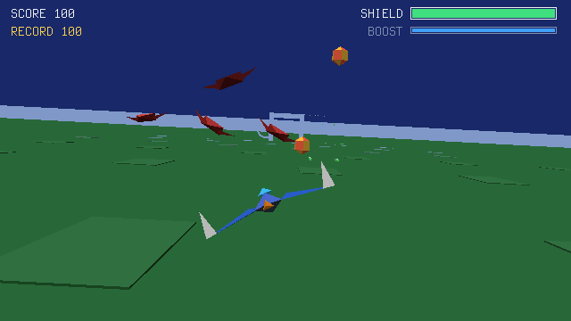
  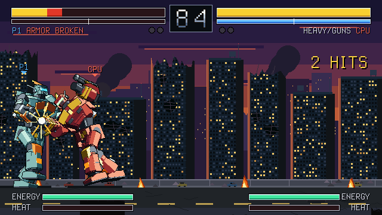
  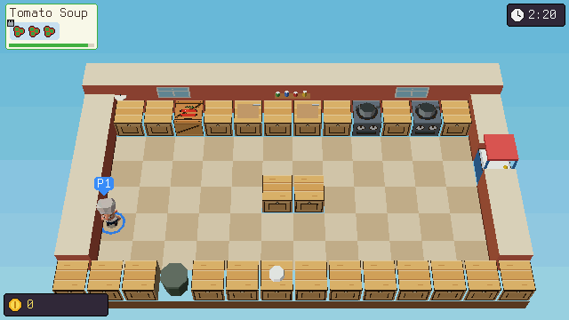
  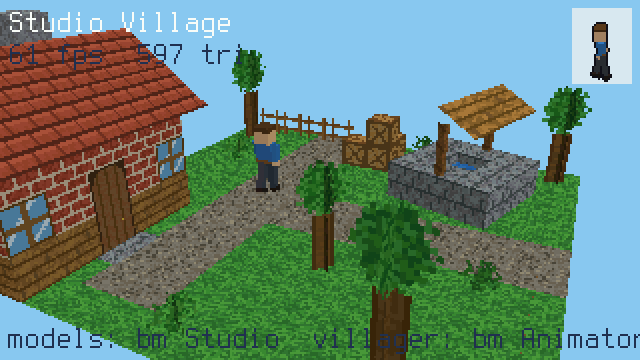
  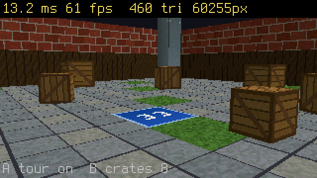
  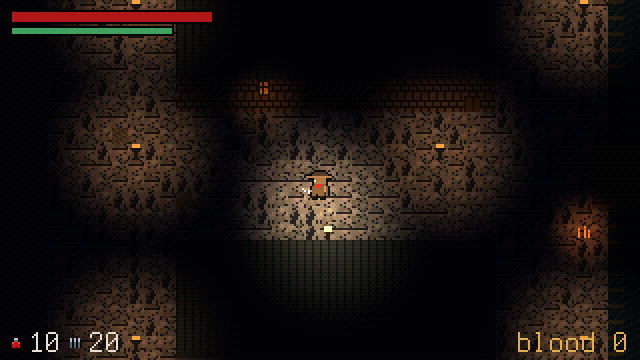
</p>

- **Overbit** (in progress, M31): a hero shooter in 3D, first person, 8 heroes with the
  kits of Overwatch's (our own names and looks). First hero: **Rally**, a tank in a mech.
- **Astro Wing**: 3D flight.
- **Titan Clash**: giant robots fighting, against the CPU or two players.
- **Chaos Kitchen**: co-op cooking in 3D for 1 to 4 players.
- **Studio Village**: bm Studio models and a villager animated with bm Animator.
- **Texture Room**: a 3D room, all textured.
- **Hunter's Night**: gothic 2D at 320×180, with lights.
- The rest: Pong (2 players), Snake, Star Shooter, and **nano8** for `.p8` carts.

The console screenshots come from QEMU (`tests/qemu_test.py --shots DIR`). The bm Studio
and bm Animator ones come from `make test-studio-ui` and `make showreel`.

To write a game, see the guide [docs/GUIDA-GIOCHI.md](docs/GUIDA-GIOCHI.md) and the
reference [docs/API.md](docs/API.md). Both are in Italian, like the rest of the documentation.

## Quick start

```sh
make firmware && make image      # dist/bm.img: firmware, kernel and games
make test                        # tests on the PC and end to end in QEMU
```

1. Write `dist/bm.img` to a microSD card with Raspberry Pi Imager ("Use custom"),
   balenaEtcher or `dd`.
2. Connect HDMI and a USB keyboard or gamepad. The keyboard or gamepad needs an OTG
   adapter on the middle micro-USB port.
3. Power on.

Needs `arm-none-eabi-gcc`, Python 3, `dosfstools` and `mtools`, plus QEMU for the tests.

- The full documentation, in Italian: [README_OLD.md](README_OLD.md). It covers the
  monitor, keys, network, releases, the Pi 1, the source layout and technical notes.
- The plan: [docs/ROADMAP.md](docs/ROADMAP.md).

## License

bm is by F. Accomando and is released under the **BM Community License 1.0**
([`LICENSE`](LICENSE)).

- Individuals may use, modify and redistribute it freely, including commercially on
  their own account.
- Attribution is required.
- Modified versions must publish their source under the same license.
- Organisations need a separate commercial license.

Third-party components keep their own licenses: Lua (MIT), lwIP (BSD), mbedTLS
(Apache 2.0) and the Mozilla root certificates. They are listed in
[README_OLD.md](README_OLD.md#licenza).
