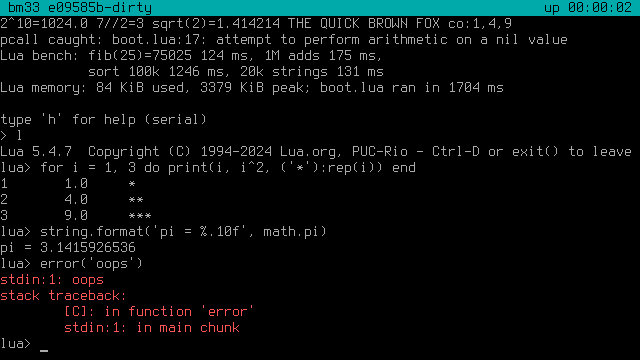
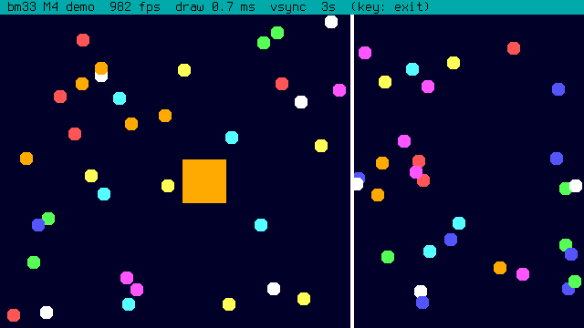
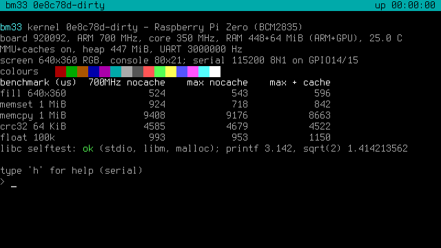
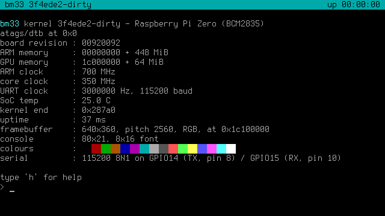
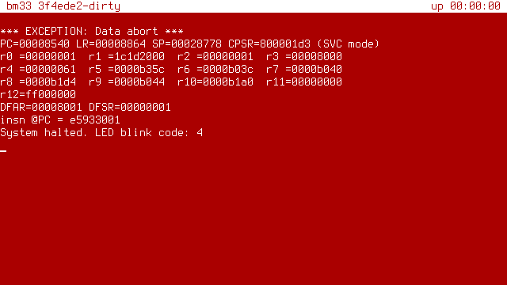
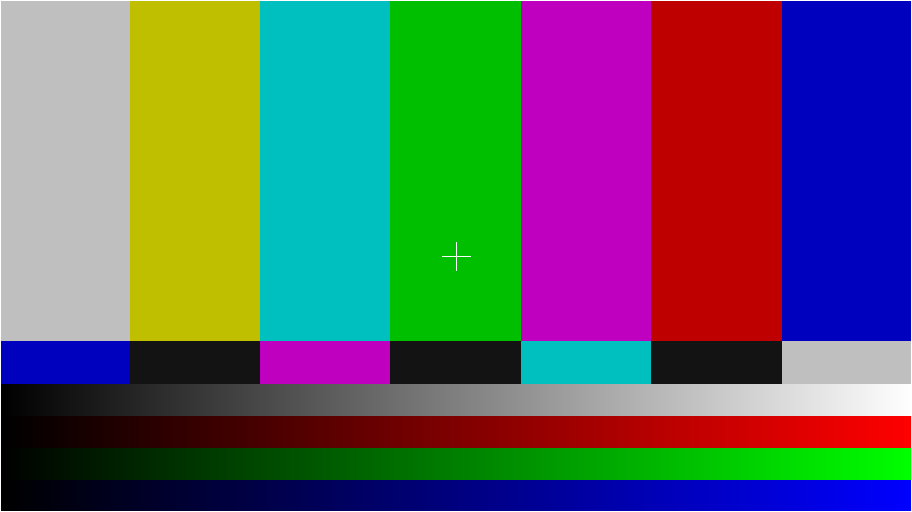
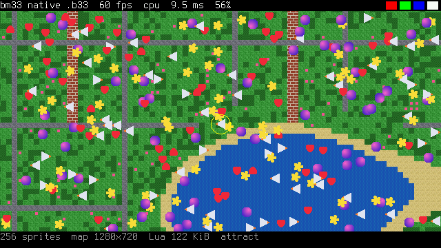

# bm33 — bare metal console per Raspberry Pi Zero W

MVP di una console bare metal (Assembly / C / Lua embedded) per
**Raspberry Pi Zero W v1.1** (SoC BCM2835, CPU ARM1176JZF-S, ARMv6).

## In breve: giocare

```sh
make firmware && make image      # dist/bm33.img (64 MiB): firmware, kernel e giochi
```

Scrivi `dist/bm33.img` sulla microSD con **Raspberry Pi Imager** ("Use custom"),
balenaEtcher o `dd`; collega HDMI e una **tastiera o un gamepad USB** (adattatore OTG
sulla porta micro-USB centrale) e accendi. Il Pi si avvia in un paio di secondi sul
**menu delle cartucce**: Pong, Snake, Star Shooter e le demo. Frecce per scegliere,
Invio (o A) per giocare, **Esc** (o Start+Select) per tornare al menu.
Per scrivere un gioco: [docs/API.md](docs/API.md).

## Roadmap

Dettagli, criteri di completamento e rischi in [docs/ROADMAP.md](docs/ROADMAP.md).
Risorse del Pi Zero W e quanto ne usano bm33/s32: [docs/HARDWARE.md](docs/HARDWARE.md).
Stress test di rendering (soglie 60/30 fps): [docs/STRESS.md](docs/STRESS.md) — `make sdcard-stress`.

| # | Obiettivo | Stato |
|---|-----------|-------|
| **M0** | Boot + test pattern HDMI | ✅ |
| **M1** | Debug: UART, eccezioni, chainloader seriale, CI | ✅ |
| **M2** | Console testuale su schermo | ✅ |
| **M3** | MMU, cache, heap, newlib | ✅ |
| **M4** | Interrupt, timer, double buffering 60 fps | ✅ |
| **M5** | Lua 5.4 embedded + REPL | ✅ |
| **M6** | Core **s32** in C: cartucce `.cart` compatibili con lua32 | ✅ |
| **M7** | Cartucce native **`.b33`**: Lua 5.4 + grafica C a 640×360 RGB565 | ✅ |
| **M7b** | Input: tastiera e gamepad **USB** (HID) | ✅ tastiera verificata sul Pi (gamepad solo QEMU) |
| **M8** | **SD** + FAT32, menu delle cartucce | ✅ verificato sul Pi |
| **M9** | **MVP**: avvio sul menu, giochi demo, immagine SD, guida API | ✅ verificato sul Pi |
| M10 | Audio: HDMI (o PWM), APU s32, suoni nei giochi | |
| **M11** | SD in scrittura: salvataggi, record, impostazioni | ✅ QEMU, da verificare sul Pi |
| M12 | Controller **Bluetooth** (uno di riferimento, poi altri) | |
| M13 | Altri tipi di cartuccia: s32 Lua (con lua32), codice ARM nativo | |
| M14 | Grafica 2.0: DMA, modo 32 bit, 3D con texture, menu con anteprime | |

## Cosa fa il kernel

All'avvio (circa 2 secondi):
1. `src/boot/start.S`: maschera gli IRQ, imposta uno stack per ogni modo della CPU,
   installa i vettori delle eccezioni a `0x0`, abilita la VFP, azzera `.bss`
2. inizializza il LED ACT e la seriale (PL011 su GPIO14/15, 115200 8N1)
3. ottiene dal firmware un framebuffer **640×360** a 32 bpp (la GPU lo scala
   sull'uscita HDMI: ×2 a 720p, ×3 a 1080p) e avvia la **console testuale**:
   80×21 caratteri, font 8×16, barra di stato con versione e uptime, colori ANSI;
   tutti i messaggi (`kprintf`, e `printf` di newlib) vanno sia sulla seriale sia sullo schermo
4. heap (da fine kernel a fine RAM ARM, ~445 MiB), clock ARM al massimo (1 GHz),
   **MMU + cache**; riga con scheda, clock, memoria e temperatura
5. **interrupt**: tick di sistema a 1 kHz (system timer, compare 1), che fa anche
   lampeggiare il LED; misura la frequenza reale e la mostra
6. **USB**: riconosce il dispositivo collegato (righe `usb: ...`), poi legge la **SD**
   e cerca le cartucce (riga `sd: SDHC card, FAT32, ...; N cartridges`)
7. apre il **menu delle cartucce**; Esc (o Start+Select, o `q` dalla seriale) porta
   al **monitor** a tasto singolo (dalla seriale o dalla tastiera USB)

La sequenza di avvio delle versioni precedenti (benchmark CPU, self-test di newlib,
demo s32 in modalità *attract*, benchmark e demo `.b33`, sonda del vsync, script
Lua `boot.lua`) si esegue dal monitor con **`b`**.

| Tasto | Azione |
|-------|--------|
| `h` | aiuto |
| `b` / `B` | diagnostica: la vecchia sequenza di avvio (benchmark, demo s32 e b33, `boot.lua`) |
| `l` | **REPL Lua** (Ctrl-D o `exit()` per tornare al monitor) |
| `i` | info di sistema |
| `c` | pulisce lo schermo |
| `m` | uso dell'heap |
| `k` | esegue di nuovo il benchmark |
| `d` | demo animata in C (60 fps, doppio buffer; un tasto la interrompe) |
| `g` | gioca `demo.cart` (s32): w/a/s/d o frecce, spazio = azione, q o Esc = esci |
| `n` | gioca `demo.b33` (nativa): frecce/wasd, spazio = A, k/x = B, q o Esc = esci |
| `M` | **menu delle cartucce** (SD; le demo incorporate se la SD non ne ha) |
| `f` / `F` | elenca le cartucce / rilegge la SD |
| `y` | USB: cerca di nuovo il dispositivo (dopo averlo collegato) |
| `Y` | USB: test dal vivo per 10 s (contatori ok/nak/err e ultimo report) |
| `L` | layout tastiera: italiano ↔ US |
| `p` | benchmark di rendering 640×360 RGB565, disegnando direttamente sullo schermo e via RAM |
| `V` | cartucce `.b33`: disegno diretto sullo schermo (default) o via buffer in RAM |
| `U` | riceve una cartuccia dalla seriale (`bm33_load.py PORTA --cart file.b33`) e la esegue |
| `s` / `S` | stress test di rendering (sprite, triangoli, 3D; C e Lua): vedi [docs/STRESS.md](docs/STRESS.md) |
| `t` | test pattern HDMI (un tasto qualsiasi torna alla console) |
| `r` | reboot via watchdog (con il chainloader, ricarica il kernel) |
| `X` poi `u` `s` `b` `a` | test di crash: undefined instruction, SVC, prefetch abort (BKPT), data abort (due tasti, per non fermare la console per errore) |

Un'eccezione fatale stampa PC/LR/SP/CPSR, r0–r12, DFAR/DFSR o IFSR e
l'istruzione in errore, sulla seriale **e sullo schermo** (bianco su rosso),
e il LED lampeggia il codice. Senza cavo seriale basta quindi l'HDMI per il debug.

Senza adattatore seriale basta una **tastiera USB**: i comandi del monitor e il
REPL Lua funzionano anche da lì.

## Tastiera, gamepad e SD (M7b, M8)

**USB.** Il Pi Zero W ha una sola porta micro-USB OTG (quella vicino al centro,
*non* quella di alimentazione): serve un adattatore OTG micro-USB → USB-A.
Si usa **un dispositivo alla volta** collegato direttamente (niente hub USB).
Il dispositivo va collegato prima dell'accensione (o dopo, con il comando `y`).

All'avvio compare una riga `usb: ifN class ...` per ogni interfaccia del dispositivo
e poi quella scelta; con tastiere composite (es. Apple Magic Keyboard, verificata)
viene scelta l'interfaccia tastiera, anche se il dispositivo usa i report con ID.

- **Tastiera** (protocollo boot HID): layout **italiano** (`L` passa a US), lettere
  accentate, ripetizione dei tasti. Nei giochi: frecce o WASD, spazio/Z/J = A,
  X/K = B, Invio = Start, Tab = Select, **Esc = esci**.
- **Gamepad HID generici** (il descrittore HID viene analizzato: pulsanti, assi X/Y,
  croce direzionale) e **controller Xbox 360 cablati**: croce o levetta sinistra,
  A/X = A, B/Y = B, **Start+Select (Back) = esci**.

**SD.** All'avvio il kernel legge la prima partizione **FAT32** (o FAT16) della SD
(quella da cui si avvia il Pi) e cerca i file **`.b33`** e **`.cart`** nella
cartella `carts/` e nella radice. Nomi lunghi supportati. `make sdcard` mette in
`dist/carts/` i giochi e le demo (`pong.b33`, `snake.b33`, `shooter.b33`, `demo.b33`,
`stress.b33`, `demo.cart`); `make image` li mette nell'immagine SD.

**Menu delle cartucce.** Mostra titolo e autore letti dalle cartucce (ordinate per
titolo) e sotto il nome del file scelto. Su/giù per scegliere, Invio (o A) per giocare,
Esc (o Start+Select) per tornare al menu dal gioco e dal menu al monitor; `R` rilegge la SD.
Dalla seriale: w/s, Invio, q. Per aggiungere un gioco basta copiarlo in `carts/`
sulla SD dal PC.

**Scrittura (M11).** bm33 scrive solo nella cartella `bm33/` della SD:
`bm33/config.txt` (layout della tastiera, modo di disegno; si può modificare anche dal
PC) e `bm33/save/*.SAV` (salvataggi e record delle cartucce: `save()`/`saved()`).

Limiti attuali: un solo dispositivo USB, senza hub; niente
Bluetooth (il chip BCM43438 usa la stessa UART della console seriale e richiede
firmware e stack HCI/L2CAP/HID: troppo per ora).

Stato del LED ACT:
- **acceso fisso**: inizializzazione in corso (se resta così, blocco prima degli interrupt)
- **lampeggio a 1 Hz**: kernel in esecuzione (generato dall'interrupt del timer:
  se si ferma, gli interrupt sono bloccati)
- **N lampeggi + pausa**: eccezione N (1 undef, 2 SVC, 3 prefetch abort, 4 data abort,
  6 IRQ, 7 FIQ, 9 panic)
- **lampeggio a 0,5 Hz** (cambia stato ogni secondo): chainloader in attesa del kernel

REPL Lua (M5, QEMU):



Demo animata su Pi Zero W reale: 600 frame in 10 s, intervallo tra frame
16667 µs costante, 0 frame persi, 2,7 ms di disegno per frame (su 16,7 disponibili),
timer IRQ misurato 999 Hz, nessun tearing visibile. Il ritmo è dato dal timer:
il vsync del firmware non è stato usato (vedi la riga `vsync probe` all'avvio).

Demo animata (M4, QEMU):



Schermata di avvio (QEMU: i tempi non sono indicativi, QEMU non emula cache e clock):



Benchmark misurato su Pi Zero W reale (µs, più basso è meglio):

| Test | 700 MHz, no cache | 1 GHz, no cache | 1 GHz + MMU/cache | Guadagno |
|------|------:|------:|------:|------:|
| fill 640×360 | 4270 | 4272 | 2160 | ×2,0 |
| memset 1 MiB | 7308 | 7316 | 2395 | ×3,1 |
| memcpy 1 MiB | 19390 | 19424 | 10269 | ×1,9 |
| crc32 64 KiB | 35720 | 35573 | 3670 | ×9,7 |
| float 100k | 8399 | 8304 | 1400 | ×5,9 |

Senza cache il clock non conta: ogni istruzione viene letta dalla SDRAM, quindi
700 MHz e 1 GHz danno gli stessi tempi. Il codice di calcolo (crc32, float) guadagna
6–10 volte con le cache; memset/memcpy/fill restano limitati dalla banda della RAM.

Console ed eccezione (M2):

 

Test pattern (comando `t`):



## Che versione ho sulla SD?

La sigla nella barra azzurra in alto a sinistra (es. `bm33 1b31924`) è il commit git
del kernel. `git log --oneline` mostra a quale milestone corrisponde; se compare
`-dirty` il kernel contiene modifiche locali non committate.

| Commit | Contenuto |
|---|---|
| `7044581` | M5: Lua embedded |
| `ab9af30` | M6: core s32 (demo.cart all'avvio) |
| `c7ec2c3` | M7: cartucce native .b33 (demo nativa all'avvio) |
| `1b31924` | stress test di rendering e 3D software (`make sdcard-stress`) |
| `a2a8b6f` | M7b + M8: tastiera/gamepad USB, SD e menu delle cartucce |
| `25f5dbc` | tastiere USB composite (Apple Magic Keyboard) |
| `a7223f7` | M9: avvio direttamente sul menu (diagnostica con `B`); dopo: giochi demo, `make image` |

## Requisiti

```sh
sudo apt install gcc-arm-none-eabi binutils-arm-none-eabi qemu-system-arm make curl python3 \
    dosfstools mtools     # per i test SD in QEMU
```

## Build e test

```sh
make                  # build/kernel.img + build/chainloader.img
make test             # test end-to-end in QEMU: boot, console, schermo, eccezioni, chainloader
make qemu             # esegue in QEMU (-M raspi0), seriale sul terminale
make qemu-screenshot  # esecuzione headless, salva build/screen.png
```

La CI GitHub Actions (`.github/workflows/ci.yml`) esegue build e `make test` a ogni push.
Se modifichi di proposito il test pattern: `python3 tests/qemu_test.py --update-ref`.
I test leggono il testo mostrato sullo schermo confrontando ogni cella 8×16
con i glifi del font, quindi verificano anche ciò che appare sull'HDMI.

## s32

bm33 esegue le cartucce `.cart` della console **s32** del progetto
[lua32](https://github.com/f-accomando/lua32): stessa macchina (320×224, tile 8–64 px,
8 palette × 256 colori RGB888, VRAM 552 KiB, 512 sprite, APU a 8 canali), implementata
in C nativo. Il contratto comune è `spec/s32/s32-spec.md`; i vettori di conformità
generati da lua32 devono passare **byte per byte**:

```sh
make test-s32        # core s32 compilato per il PC
make test-s32-arm    # stesso codice compilato per ARM1176, in qemu-arm
scripts/sync-s32-spec.sh ../lua32   # aggiorna spec e vettori da lua32
```

Sul Pi Zero il core s32 esegue la demo a circa 26 µs per tick in QEMU (CPU s32 +
PPU in C); i numeri reali vanno misurati sul Pi (riga `s32:` all'avvio).


## Cartucce native `.b33`

Cartucce solo per bm33 che sfruttano il Pi Zero: **640×360, colore diretto a 16 bit
(RGB565), 60 fps**, logica in Lua 5.4, tutto il disegno in C. Formato in
`src/b33/b33.h` (header + sezioni: codice Lua, sprite sheet RGBA, mappa); la grafica
è salvata in un formato indipendente dallo schermo, pronta per un futuro 32 bit.

```sh
python3 scripts/mkb33.py -o gioco.b33 --lua main.lua --sheet sheet.png --map map.csv \
        --title "Il mio gioco"
```

La cartuccia definisce `_init()`, `_update()` e `_draw()` (60 volte al secondo) e usa
un'API in stile PICO-8: forme, sprite e mappa, testo, input (`btn`/`btnp`), tempo,
3D software. **Riferimento completo e guida alla prima cartuccia: [docs/API.md](docs/API.md).**
Giochi di esempio: `carts/pong`, `carts/snake`, `carts/shooter` (solo Lua, sprite
disegnati nel codice con `sset`), `carts/demo` (sprite sheet PNG e mappa CSV).

Sandbox: niente `io`, `os`, `load`, `dofile`, `require`. Un errore o un ciclo infinito
(oltre 20 milioni di istruzioni in un frame) ferma la cartuccia e mostra l'errore
sulla console, senza bloccare il kernel. Il disegno va direttamente nella pagina
nascosta del framebuffer (in alternativa, comando `V`, in un buffer in RAM copiato
una volta per frame: `p` confronta i due modi).



## Lua

Lua 5.4.7 completo (numeri double, interi a 64 bit, coroutine, string, table,
math, utf8, os, io su stdout/stdin). `print` scrive su seriale e schermo.
Gli errori non bloccano il kernel: vengono stampati in rosso con il traceback.
Lua ha un limite di 64 MiB di memoria; oltre, `not enough memory` (recuperabile).

Prestazioni misurate su Pi Zero W (1 GHz, MMU e cache attive): `fib(25)` 83 ms,
1 milione di addizioni in un ciclo 104 ms, `table.sort` di 100k interi 657 ms,
20k `tostring` + `table.concat` 104 ms. In un frame a 60 fps (16,7 ms, di cui
~2,7 ms per disegnare) restano circa 150k operazioni Lua semplici.

Modulo `bm33`:

| Funzione | Descrizione |
|----------|-------------|
| `bm33.micros()` | contatore a 1 MHz (intero) |
| `bm33.millis()` | millisecondi dal tick di sistema |
| `bm33.sleep(ms)` | attesa |
| `bm33.mem()` | byte usati da Lua, picco, byte in uso nell'heap C |
| `bm33.color(fg [, bg])` | colori della console 0–15 (ordine ANSI) |
| `bm33.cls()` | pulisce lo schermo |
| `bm33.reboot()` | riavvio (watchdog) |
| `bm33.version` | versione del kernel |

Senza seriale non puoi scrivere nel REPL; per ora lo script eseguito all'avvio
è `src/script/boot.lua` (modificalo e ricompila). Da M8 le cart Lua si
caricheranno dalla SD.

## Collegamento seriale

Adattatore USB-seriale **a 3.3 V** (mai 5 V: danneggia il SoC). Non collegare il VCC.

| Pi Zero (header) | Adattatore |
|------------------|------------|
| pin 6 — GND | GND |
| pin 8 — GPIO14 TXD | RX |
| pin 10 — GPIO15 RXD | TX |

Su Linux aggiungi l'utente al gruppo `dialout`; su macOS la porta è `/dev/cu.usbserial-*`.

## Sviluppo con il chainloader (consigliato)

Il chainloader si scrive **una sola volta** sulla SD; da lì in poi ogni kernel
arriva dalla seriale.

```sh
make firmware
make sdcard-chainloader       # dist/ con chainloader.img come kernel.img
# copia dist/ sulla SD, inserisci la SD nel Pi

make run-serial PORT=/dev/ttyUSB0
# accendi il Pi: il kernel viene inviato e si apre il terminale (Ctrl-] per uscire)
```

Ciclo di sviluppo: modifica il codice, `make` in un altro terminale, premi `r`
nel terminale seriale → il Pi si riavvia e riceve il nuovo `build/kernel.img`.

Protocollo (vedi `chainloader/main.c`): il loader invia `\x03\x03\x03` ogni
secondo; il PC risponde `BM33` + dimensione + CRC-32; il loader verifica, copia il
kernel a `0x8000` e ci salta. Il chainloader si ricopia prima a `0x02000000`, quindi
il kernel può essere grande fino a ~31 MiB. A 115200 baud la velocità è ~11 KB/s:
con Lua il kernel è ~340 KB, cioè ~30 s per caricarlo. Conviene `BAUD=921600` (deve essere uguale per build e `run-serial`,
e va rifatto anche il chainloader sulla SD).

## Aggiornare solo il kernel sulla SD (senza seriale)

Dalla cartella del progetto, con la SD montata (in WSL: `sudo mount -t drvfs D: /mnt/d`):

```sh
make sdcard
cp dist/kernel.img dist/config.txt /mnt/d/
mkdir -p /mnt/d/carts && cp dist/carts/* /mnt/d/carts/     # cartucce
```

## Scheda SD senza chainloader

Il modo più semplice è l'immagine completa: `make firmware && make image`, poi scrivi
`dist/bm33.img` con Raspberry Pi Imager ("Use custom"), balenaEtcher o `dd`
(serve `sudo apt install dosfstools mtools`). In alternativa, a mano:

1. Formatta la SD con una partizione **FAT32** (tabella MBR).
2. `make firmware && make sdcard` (per fissare una versione del firmware: `FW_REF=<tag> make firmware`).
3. Copia il contenuto di `dist/` nella root della SD (`cp -r dist/* /mnt/d/`):
   `bootcode.bin  start.elf  fixup.dat  config.txt  kernel.img  carts/`
4. Collega l'HDMI (mini-HDMI) *prima* di alimentare il Pi.

## Struttura

```
boot/config.txt          configurazione del firmware (HDMI forzato, no overscan)
linker.ld                kernel a 0x8000, stack per modo CPU
src/boot/start.S         entry point ARM, stack, vettori, VFP, .bss
src/kernel/main.c        kernel_main
src/kernel/vectors.S     tabella vettori + stub delle eccezioni
src/kernel/exceptions.c  dump dei registri, panic, schermo rosso, codice LED
src/kernel/monitor.c     monitor seriale a tasto singolo
src/kernel/sysinfo.c     info scheda via mailbox
src/kernel/testpattern.c test pattern HDMI
src/kernel/bench.c       benchmark (fill, memset, memcpy, crc32, float)
src/kernel/irq.c         controller IRQ BCM2835, registrazione e dispatch
src/kernel/tick.c        tick di sistema (system timer compare 1)
src/kernel/demo.c        demo animata a 60 fps
src/gfx/draw.c           primitive: clear, rect, sprite 16×16, testo
src/usb/                 host USB DWC2 (DMA, polling), enumerazione, HID tastiera/gamepad/Xbox 360
src/drivers/sd.c         SD sul controller EMMC (Arasan SDHCI), PIO, sola lettura
src/fs/fat.c             FAT16/FAT32 in sola lettura, nomi lunghi
src/kernel/carts.c       elenco delle cartucce (incorporate + SD) e menu
src/kernel/input.c       input unificato: seriale + tastiera/gamepad USB
src/s32/                 macchina s32: CPU, PPU, loader .cart, player 320×224
src/b33/                 cartucce native: formato, grafica RGB565 (gfx16), 3D software (r3d),
                         runtime Lua, stress test
carts/demo/              cartuccia nativa demo: main.lua, sheet.png, map.csv
carts/pong|snake|shooter giochi demo (solo Lua)
docs/API.md              API delle cartucce .b33 e guida alla prima cartuccia
scripts/mkb33.py         packer .b33 (PNG e CSV, solo libreria standard Python)
scripts/mksd.py          immagine SD (MBR + FAT32): make image e test in QEMU
tests/b33/               test host della grafica e del formato
spec/s32/                specifica comune e vettori di conformità (da lua32)
tests/s32/               runner di conformità (host e ARM in qemu-arm)
src/script/luavm.c       stato Lua, allocatore con limite (64 MiB), esecuzione protetta
src/script/repl.c        REPL: espressioni, righe di continuazione, traceback
src/script/lib_bm33.c    modulo Lua `bm33`
src/script/boot.lua      script di avvio (incluso nell'immagine con .incbin)
third_party/lua/         Lua 5.4.7 non modificato (licenza MIT)
src/kernel/selftest.c    self-test di newlib
src/arch/mmu.c           tabella delle sezioni da 1 MiB, attivazione MMU e cache
src/arch/cache.c         clean/invalidate della D-cache per range (mailbox)
src/gfx/console.c        console testuale: celle, scroll, cursore, ANSI, barra di stato
src/gfx/font8x16.c       font 8×16 CP437 (derivato da Terminus, OFL: docs/LICENSE.font)
src/drivers/             mmio, mailbox, prop tags, framebuffer, gpio, uart (PL011),
                         timer, LED, watchdog
src/lib/                 kprintf, crc32, syscalls newlib (_sbrk, _write, ...)
chainloader/             bootloader seriale (si riloca a 0x02000000)
tools/bm33_load.py       invio del kernel + terminale seriale (solo stdlib Python)
tests/qemu_test.py       test end-to-end in QEMU (anche tastiera USB, gamepad HID, SD)
tests/mksd.py            crea un'immagine SD (MBR + FAT32) per i test in QEMU
scripts/                 download firmware, screenshot QEMU, conversione font (psf2c.py)
```

## Note tecniche

- Le periferiche BCM2835 sono a `0x20000000` (lato ARM); la RAM vista dalla GPU
  è all'alias `0x40000000` (L2 cached). L'indirizzo passato alla mailbox viene
  convertito con `ARM_TO_BUS()`, quello del framebuffer restituito con `BUS_TO_ARM()`.
- Mappa di memoria (sezioni da 1 MiB, identità): RAM ARM cacheable write-back,
  memoria GPU (framebuffer) normal non-cacheable bufferable, periferiche device.
  Sull'ARM1176 il bit S rende la memoria non cacheable, quindi resta a 0.
- I buffer della mailbox stanno in RAM cacheable: `mbox_call()` fa clean+invalidate
  della D-cache prima e dopo la chiamata, perché la GPU legge la RAM, non la cache.
- Il firmware avvia l'ARM del Pi Zero a 700 MHz; il kernel chiede il massimo
  (`arm_freq`, 1 GHz) con i tag *get max clock rate* / *set clock rate*.
- Interrupt: `irq_entry` (vectors.S) salva il contesto con `srsdb`, passa in modo
  SVC, salva anche i registri VFP d0–d7 e FPSCR (il C hard-float può usarli),
  chiama `irq_handler()` e ritorna con `rfeia`. Gli IRQ non si annidano.
- Doppio buffer: framebuffer virtuale alto 2×360 righe; `fb_flip()` imposta il
  *virtual offset* sulla pagina appena disegnata e aspetta il vsync col tag
  *wait for vsync* (0x0004000E). Se il vsync manca o è finto (QEMU risponde subito),
  il ritmo dei frame lo dà il timer (60 Hz). QEMU inoltre sembra ignorare l'offset
  virtuale in visualizzazione: il tearing si verifica solo sul Pi reale.
- Il kernel è C "hosted" su newlib (`libc.a`, `libm.a`, multilib `arm/v5te/hard`);
  le syscall sono in `src/lib/syscalls.c`. Il chainloader resta freestanding.
- L'ordine dei pixel (RGB/BGR) viene letto dalla risposta del firmware e
  gestito da `fb_color()`.
- Se il monitor sceglie una risoluzione strana, decommenta `hdmi_group=1` /
  `hdmi_mode=4` (720p60) in `boot/config.txt`.
- La PL011 del Pi Zero W è collegata di default al Bluetooth tramite GPIO32/33:
  il kernel la ricollega a GPIO14/15 (ALT0), quindi il Bluetooth non è
  utilizzabile (non serve per l'MVP).
- In QEMU le immagini vengono caricate con `-bios`, cioè a `0x8000` come fa il firmware reale.
