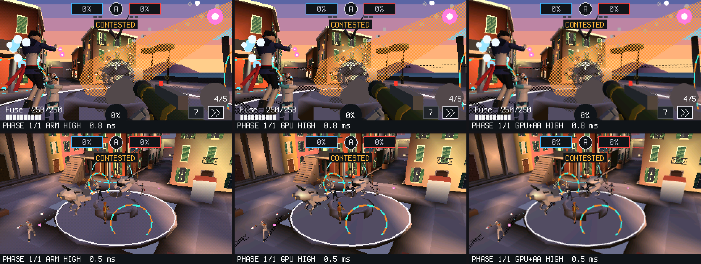

# M33/M34 — GPU e 3D più veloce: prima e dopo

Confronto tra **prima** (`9cda3c7`, 2026-09-30, l'ultimo commit prima di M33) e **dopo**
(il branch `claude/gallant-newton-z2cugw`, 2026-10-01). Il codice di M33 è tutto
scritto, provato sul PC e in QEMU, e **verificato sul Pi**: la GPU passa tutto il suo
test e Texture Room HD gira a 60 fps a 640×360. Da qui la GPU è il default per il 3D dei
giochi; l'ARM resta come riserva (sezione 4). La **sezione 7** (2026-10-03) aggiunge
Overbit con la GPU: prima e dopo a ogni qualità, quanti triangoli reggono l'ARM e la GPU,
i vertici e i triangoli dei modelli degli eroi e il budget di un 4 contro 4.

## 1. In breve

- **3D sull'ARM (ora la riserva):** stessi pixel di prima e meno istruzioni. Texture Room
  scende del 30% (5,52 → 3,86 milioni di istruzioni a fotogramma), i pixel con texture
  da 70 a 46 istruzioni l'uno.
- **3D sulla GPU (ora il default):** l'ARM non disegna più pixel, trasforma e illumina
  soltanto. Per Texture Room fa 0,62 milioni di istruzioni a fotogramma, l'89% in meno
  di prima. Da qui il costo dell'ARM dipende dai triangoli e non più dai pixel: la
  stessa stanza a 640×360 (Texture Room HD) costa all'ARM quanto quella a 320×180.
- **Correttezza della GPU:** su un emulatore della V3D le scene disegnate dalla GPU
  differiscono da quelle dell'ARM per lo 0,01–0,75% dei pixel, nei quattro ordini di
  byte possibili. I pixel diversi stanno sui bordi e sui confini dei texel.
- **Sul Pi (2026-10-01):** il 3D sull'ARM è 2,1–2,3× più veloce sui triangoli
  piccoli e i triangoli 2D quasi 2×. Texture Room HD sull'ARM fa 37–41 fps. La GPU,
  dopo una correzione al driver, passa tutto il test `g` (0,1% di pixel diversi
  dall'ARM): 182 sfere a 60 fps contro 69 dell'ARM (6× settembre), 811 Mpixel/s di
  riempimento. **Texture Room HD con la GPU: 5,8 ms, 60 fps** con 32 casse a
  640×360 (sull'ARM 25–26 ms); Chaos Kitchen 6,8 ms, 60 fps (prima 14,1 ms, 54 fps).

## 2. Cosa c'era e cosa c'è

| | Prima (`9cda3c7`) | Dopo |
|---|---|---|
| Chi disegna il 3D | solo l'ARM | l'ARM (default) o la GPU V3D (*Impostazioni > 3D of the games*) |
| GPU 3D (V3D, 12 QPU) | mai usata | driver nostro a funzioni fisse: liste di controllo, 3 shader QPU, texture dalla TMU, z a 24 bit |
| Rasterizzatore ARM | bordi in virgola mobile, un ciclo texture unico | bordi in virgola fissa 32.32, cicli texture specializzati, scarto delle mesh fuori vista; **pixel identici** |
| Pulizia dello z-buffer | CPU | DMA a fine fotogramma (`dma_zclear=0` per spegnerlo) |
| Risoluzioni delle cartucce | 640×360, 320×180 | in più **480×270** (4× esatto su 1080p) |
| Z tra 2D e 3D (GPU) | — | conservato quando serve (salvato e ricaricato dalla V3D in formato T) |
| Se la GPU non risponde | — | torna all'ARM da sola e lo scrive nel log |
| Stress test | sprite, triangoli, sfere | in più: attesa di fine avvio, clock/temperatura/throttling/interrupt, quad a tutto schermo (ns per pixel), **righe GPU** |
| Prova della GPU sul Pi | — | `g` nel monitor o *Dev > GPU test*: 11 passi sullo schermo, ARM e GPU affiancati |
| Cartucce | Texture Room 320×180 | in più **Texture Room HD** 640×360 (il criterio di chiusura) |
| Per le cartucce | — | `stat(9)` = 1 se il 3D lo fa la GPU (era `stat(6)` nel branch `3d-performance`); `stat(1)` comprende il lavoro della GPU |
| Strumenti | — | `make bench3d`, `make count-insns` (anche con la GPU), `tools/qpuasm.py`, emulatore V3D, `make test-gpu3d` |
| Test QEMU | 47 | 51 (nuovi: 480×270, GPU assente, ritorno all'ARM, Texture Room HD; stress e menu estesi) |

## 3. Numeri misurati sul PC

Sono istruzioni ARM per fotogramma, contate con `qemu-arm` sulle scene di
`tests/bm/bench3d.c` (`make count-insns`, ARM1176 con `-O2`). Cache e bus non sono
compresi: misurano il lavoro della CPU, non il tempo sul Pi. Con la GPU si conta solo
la parte dell'ARM (r3d e backend, a regime); il tempo della V3D non c'è.

| Scena | Prima | Dopo, ARM | Dopo, GPU (parte ARM) |
|---|---:|---:|---:|
| Texture Room, 8 casse (320×180, 446 triangoli) | 5,52 M | 3,86 M (−30%) | 0,62 M (−89%) |
| Texture Room, 32 casse (561 triangoli) | 8,60 M | 6,27 M (−27%) | 0,80 M (−91%) |
| 30 sfere piatte (1137 triangoli) | 4,15 M | 3,77 M (−9%) | 1,06 M (−74%) |
| 30 sfere Gouraud | 8,95 M | 8,66 M (−3%) | 1,17 M (−87%) |
| 30 sfere con texture | 14,46 M | 12,34 M (−15%) | 1,28 M (−91%) |
| 4 quad con texture (230 400 pixel) | 16,13 M | 10,55 M (−35%) | 0,02 M (−99,9%) |
| 4 quad piatti | 2,87 M | 2,39 M (−17%) | — |
| 4 quad Gouraud | 8,25 M | 7,55 M (−8%) | — |

Per pixel (solo l'ARM):

| Scena | Prima | Dopo |
|---|---:|---:|
| Quad piatti con z | 12,5 | 10,4 |
| Quad Gouraud | 35,8 | 32,7 |
| Quad con texture e luce | 70,0 | 45,8 |
| Sfere piatte (triangoli piccoli) | 24,5 | 21,6 |
| Sfere con texture | 94,8 | 79,9 |
| Texture Room, 8 casse | 84,7 | 57,7 |
| Texture Room, 32 casse | 87,8 | 62,9 |

Per triangolo, la parte dell'ARM fuori dai pixel resta quasi uguale in software
(≈ 530–710 istruzioni). Con la GPU sale a ≈ 930–1400 istruzioni, perché ogni vertice va
scritto nel formato della V3D. È il costo da tenere d'occhio: con la GPU il limite
diventa il numero di triangoli, non i pixel.

**Correttezza della GPU** (emulatore della V3D, `make test-gpu3d`). Sono le
percentuali di pixel diversi tra ARM e GPU (oltre 48 livelli su un canale), uguali nei
quattro ordini di byte:

| Scena | Pixel diversi |
|---|---:|
| Sfere piatte, Gouraud, cubo, nebbia | 0,04% |
| Texture, trasparenze, pavimento sotto la camera | 0,01% |
| Pavimento senza z, `zclear` a metà, 480×270 | 0,03% |
| 330 sfere (più gruppi di triangoli) | 0,65% |
| 700 sfere (due lavori, z conservato tra i due) | 0,75% (1,64% prima di conservare lo z) |
| Tre sprite sheet nello stesso lavoro | 0,06% |
| 3D, 2D, 3D (z conservato) | 0,02% |

## 4. Sul Pi

**Prima (misurato):**

- Texture Room: 8 casse 11,6 ms di CPU, **60 fps** (456 triangoli, 60 516 pixel con
  texture); 32 casse 18,0 ms, **54 fps**.
- Stress test (settembre): ~1200 triangoli 3D a 60 fps, ~5000 a 30 fps, circa 14 µs
  per triangolo disegnato. Il 29 settembre la parte C era più lenta senza una causa
  chiara.
- Astro Wing 6,34 ms, 59,9 fps; Chaos Kitchen 14,1 ms, 54 fps.

**Dopo, 3D sull'ARM (misurato il 2026-10-01, kernel `6c2fdaa`).** Stress test a sistema
fermo: ARM 1000 MHz, core 250 (massimo 400), V3D 250, SDRAM 400 MHz, 49,7 °C, nessun
throttling, interrupt allo 0,4%. Massimo per fotogramma a 60 fps (30 fps tra parentesi):

| Test | Settembre (`792787f`) | 29 set. (`8298b15`) | Ora (`6c2fdaa`) | Ora / settembre |
|---|---:|---:|---:|---:|
| sprite 16×16 (C) | 4482 | 3500 | 4456 | = |
| sprite 32×32 (C) | 1513 | 1183 | 1504 | = |
| triangoli 2D ~170 px | 2594 | 2053 | 5038 | **1,9×** |
| sfere 3D (C) | 31 (1195 tri) | 15 (556 tri) | 70 (2700 tri) | **2,3×** |
| sfere 3D Gouraud | — | <1 (45 a 30 fps) | 18 (84 a 30 fps) | — |
| sfere 3D con texture | — | <1 (<1 a 30 fps) | <1 (51 a 30 fps) | — |
| sprite 16×16 (Lua) | 1829 | 1854 | 1848 | = |
| sfere 3D (Lua) | 29 (1115 tri) | 26 (1015 tri) | 61 (2323 tri) | **2,1×** |

Costo di un pixel (righe nuove `quad`): piatto con z 22 ns, senza z 5 ns, Gouraud 49 ns,
texture 97 ns. Con il codice di prima Texture Room dava 130–180 ns per pixel con texture.

- Il calo del 29 settembre era un disturbo all'avvio: con l'attesa di 20 s gli sprite
  tornano ai valori di settembre.
- Sui triangoli piccoli il guadagno vero (2,3×) è molto più grande di quello previsto
  dalle istruzioni (−9%). Il rasterizzatore di prima fermava la pipeline a ogni riga
  con i confronti in virgola mobile (`vmrs`), e il conteggio delle istruzioni non lo
  vede. I triangoli 2D usano lo stesso rasterizzatore e raddoppiano anche loro.
- **Texture Room HD sull'ARM** (640×360): 8 casse 25,3 ms, 41 fps (450 triangoli,
  249 288 pixel con texture); 16 casse 26,3 ms, 37 fps (485 triangoli, 287 057 pixel).
  Sono 4 volte i pixel di Texture Room nel doppio del tempo.

**Dopo, 3D sulla GPU.** Prima prova (`6c2fdaa`): la V3D si accendeva e rispondeva
(250 MHz, 3 slice × 4 QPU, 2 TMU per slice, VPM 12 KiB), ma la prima pulizia si fermava
con "no end of frame". Dai registri (`CT1CA = CT1EA`, `PCS = 0x104`, `RFC = 0`) si vedeva
che la colpa era dell'attesa nel driver: trattava come errore il bit "binner senza
memoria" di `PCS`, acceso fin dall'avvio anche quando il binner non si usa. Corretto, con
un test sul PC che simula i registri come li ha mostrati il Pi (`make test-v3d`).

Seconda prova (`d0c7fe8`, 2026-10-01): **test `g` superato in tutti gli 11 passi**.

| Passo | Risultato |
|---|---|
| 3 pulizia | 211 µs, byte a = rosso |
| 4 un triangolo | binning 3 µs, rendering 296 µs |
| 6 20 000 triangoli piccoli | preparati dall'ARM in 7,7 ms; binning 2,7 ms + rendering 4,1 ms: **3,0 milioni di triangoli/s** |
| 7 20 schermi interi | rendering 5,7 ms: **811 Mpixel/s** (l'ARM: ~45 Mpixel/s in tinta unita) |
| 8 texture dalla TMU | ok, texel nello stesso ordine del tile buffer |
| 10 stessa scena ARM e GPU (3309 triangoli, 640×360) | ARM 28,8 ms, GPU **9,1 ms** (di cui binning 0,6 e rendering 1,5); **0,1%** di pixel diversi |
| 11 3D, 2D, 3D | ARM 9,5 ms, GPU 3,9 ms (2 lavori con lo z salvato e ricaricato); **0,0%** di pixel diversi |

Righe GPU dello stress test (stesse scene delle righe ARM; massimo per fotogramma):

| Test | ARM 60 fps | GPU 60 fps | GPU 30 fps | GPU / ARM |
|---|---:|---:|---:|---:|
| sfere 96 piatte | 69 (2679 tri) | **182 (7142 tri)** | 389 (15 346 tri) | 2,6× |
| sfere Gouraud | 18 (703 tri) | **170 (6673 tri)** | 364 (14 360 tri) | 9,4× |
| sfere con texture | <1 (52 a 30 fps) | **156 (6094 tri)** | 333 (13 135 tri) | — |
| quad 320×180 piatti | 11 (22 ns/px) | **200 (1 ns/px)** | 430 | 18× |
| quad 320×180 Gouraud | 5 (49 ns/px) | **199 (1 ns/px)** | 427 | 40× |
| quad 320×180 texture | 2 (98 ns/px) | **28 (9 ns/px)** | 60 | 14× |

Rispetto a settembre (31 sfere, 1195 triangoli a 60 fps) sono sei volte i triangoli.
Cosa dicono i numeri:

- Con la GPU il limite è l'ARM, non la V3D. Nel passo 10 la GPU lavora 2,1 ms su 9,1:
  il resto (≈ 2 µs per triangolo) è r3d che trasforma, illumina e scrive i vertici. Lo
  stesso si vede sulle sfere (80 µs per sfera di ~39 triangoli).
- Le texture sono il punto debole della GPU: 9 ns per pixel contro 1. Una texture
  256×256 in ordine di riga (RGBA32R) sfrutta male la cache della TMU; il formato a tile
  (T-format) dovrebbe avvicinarle al piatto.
- Salvare e ricaricare lo z costa circa 1 ms per lavoro a 640×360 (passo 11), come
  previsto: per questo si fa solo quando serve.
- La parte Lua dello stress è girata sull'ARM (in *Impostazioni* il 3D era su `ARM`).

**I giochi con la GPU** (stesso kernel, 2026-10-01):

| Gioco | Prima di M33 (ARM) | Dopo, ARM | Dopo, GPU |
|---|---|---|---|
| Texture Room HD, 640×360 | — | 8 casse 25,3 ms, 41 fps; 16 casse 26,3 ms, 37 fps | **32 casse, 573 triangoli: 5,8 ms, 60 fps** |
| Texture Room, 320×180, 8 casse | 11,6 ms, 60 fps | — | — |
| Chaos Kitchen 1-1 | 14,1 ms, 54 fps | — | **6,8 ms, 60 fps** (758 triangoli) |

Texture Room HD con quattro volte i pixel di Texture Room e quattro volte le casse costa
la metà del tempo che Texture Room costava prima di M33. Il criterio di chiusura (60 fps
a 640×360 con la GPU, righe GPU nello stress test) è raggiunto.

**Per rifare queste misure:** Texture Room e Texture Room HD ora sono un solo benchmark
nella scheda Dev (comando `R` del monitor). Raddoppia le casse da 8 finché la stanza
tiene 30 fps, a 320×180 e poi a 640×360, con l'ARM e poi con la GPU, e chiude con le
casse massime a 60 e a 30 fps per ciascun caso.

## 5. Differenze rimaste tra ARM e GPU

- Gouraud senza dithering sulla GPU: le sfumature sono più lisce.
- Z a 24 bit sulla GPU contro 16 sull'ARM: meno errori di profondità sugli oggetti
  vicini tra loro.
- Sulla GPU lo z-buffer riparte da zero a ogni fotogramma, anche senza `zclear()`.
- `stat(5)` (pixel 3D) vale 0 con la GPU.
- Il 3D dopo il 2D nello stesso fotogramma: lo z si conserva dal secondo fotogramma
  in poi. Nessuno dei giochi lo fa: disegnano tutti prima il 3D e poi l'HUD.

## 6. Cosa resta (dopo M33)

- Il costo per triangolo dell'ARM (≈ 2 µs) ora è il limite: da ridurre in r3d per il
  percorso GPU, o spostando le trasformazioni sulle QPU.
- Texture in T-format per la TMU (oggi 9 ns per pixel con texture contro 1 senza).
- Rinviati: MSAA 4× (caricare la pagina in un tile multicampione non è un percorso di
  Mesa né di Linux, quindi va provato sul Pi), filtro bilineare (cambia l'aspetto delle
  texture), sprite 2D sulla GPU.

## 7. Overbit sulla GPU (2026-10-03)

Il gioco più pesante di bm con la GPU: cosa è cambiato in Overbit (M31) da quando la GPU
disegna i suoi triangoli, quanti triangoli reggono il Pi e la GPU, quanti ne hanno i
modelli degli eroi e quanti ne servono per un 4 contro 4. Misure del 2026-10-03, branch
`claude/overclone`: **prima** è `e7632bd` (Overbit prima dell'unione con la GPU, tutto
sull'ARM), **dopo** è questo branch con la GPU.

### 7.1 In breve

- **Overbit con la GPU** fa fare all'ARM il **23–32% di istruzioni in meno** a ogni
  qualità nello scontro più pesante del benchmark (10 bot sul punto). Stima sul Pi:
  LOW da ~36 a ~50 fps, MEDIUM da ~34 a ~45, HIGH da ~30 a ~36, ULTRA da ~25 a ~34,
  EXTREME da ~25 a ~31.
- **E disegna meglio**: ombre degli eroi da HIGH (prima da ULTRA), Gouraud da MEDIUM
  (prima da HIGH), luce e nebbia sfumate sulle texture della mappa, le esplosioni che
  illuminano i muri, z-buffer a 24 bit, MSAA 4× a scelta. HIGH con la GPU costa quanto
  costava LOW sull'ARM.
- **Le ottimizzazioni di oggi** valgono il 14% del fotogramma con la GPU (driver, ombre,
  trasformazioni, particelle e anelli del Lua), quasi tutte a pixel identici.
- **Un triangolo** di Overbit costa all'ARM ~1100 istruzioni con la GPU (~2070 prima,
  con i pixel): ~2,8 µs con la V3D, **~6000 triangoli a 60 fps** se non ci fosse
  altro. Senza GPU il limite sono i pixel (2700 triangoli piccoli nello stress test).
- **Un 4 contro 4 a 60 fps** su Partenope oggi lascia agli eroi poco: simulazione,
  Lua del disegno e mappa prendono ~15 ms dei 16,7: ~150 triangoli per eroe a 60 fps,
  ~1900 a 30 fps (i modelli di oggi ci stanno). Per i 60 fps vanno alleggerite prima la
  simulazione e la mappa, non gli eroi (7.7).
- **Gli eroi** hanno ~1000 triangoli e ~750 vertici al dettaglio massimo (da 652 a
  1394 triangoli), ~320 triangoli e ~240 vertici al minimo (da 220 a 472): tabella in 7.6.

### 7.2 Come si misura

Senza il Pi, il lavoro dell'ARM si conta: `tests/overbit/frames.py` compila bmhost (il
runtime vero delle cartucce) per ARM Linux con le opzioni dell'ARM1176, lo fa girare in
`qemu-arm` e conta le istruzioni di ogni fotogramma, per funzione e per parte (Lua, r3d,
driver della GPU, 2D, collisioni, audio). La scena è lo scontro del benchmark di Overbit
(`OVERBIT_BENCH_HOT`): le due squadre di 5 bot faccia a faccia sul punto, 2 s negli occhi
di un bot e 2 s dall'alto, la stessa partita in ogni prova (stesso seme, simulazione
identica). È il caso pesante: 10 eroi, abilità, esplosioni, particelle.

- **Istruzioni → millisecondi**: 2,2 ns per istruzione, misurati sul Pi nel 3D dello
  stress test (sfere della GPU: 936 istruzioni per triangolo ↔ 2,04 µs). È una stima:
  sul Pi le fermate della pipeline (confronti in virgola mobile, cache) pesano più o
  meno a seconda del codice (`docs/PRESTAZIONI.md`, sezione 6).
- **La V3D** lavora mentre l'ARM aspetta (`v3d_run` è sincrono): al tempo dell'ARM si
  aggiungono ~0,34 µs per triangolo (binning 2,7 ms + rendering 4,1 ms per 20 000
  triangoli piccoli, passo 6 del test `g` sul Pi) e ~0,1 ms per lavoro (le tile della
  pagina caricate e salvate).
- **Il giudice resta il Pi**: il benchmark nel gioco (*Overbit > BENCHMARK*) misura i
  tempi veri di ogni fase e li mostra in tre pagine.

### 7.3 Prima e dopo

Lo scontro del benchmark (10 bot sul punto; prima persona e dall'alto, 2 s l'una),
le stesse partite al fotogramma, prima sull'ARM e dopo sulla GPU:

| Qualità | | M istruzioni ARM (1ª persona / dall'alto) | V3D | ms stimati | fps stimati | triangoli | vertici |
|---|---|---:|---:|---:|---:|---:|---:|
| LOW | prima (ARM) | 13,06 / 12,17 | — | 27,8 | 36,0 | 3717 | 6872 |
| | **dopo (GPU)** | **8,90 / 8,17** (−32%) | 1,4 ms | **20,2** | **49,6** | 3363 + 320 | 6304 |
| MEDIUM | prima (ARM) | 14,01 / 12,98 | — | 29,7 | 33,7 | 4257 | 7679 |
| | **dopo (GPU)** | **9,91 / 8,84** (−31%) | 1,6 ms | **22,2** | **45,0** | 3742 + 484 | 6919 |
| HIGH | prima (ARM) | 16,20 / 14,28 | — | 33,5 | 29,8 | 4970 | 8889 |
| | **dopo (GPU)** | **12,47 / 10,99** (−23%) | 2,3 ms | **28,1** | **35,5** | 4675 + 1697 | 8445 |
| ULTRA | prima (ARM) | 19,14 / 17,13 | — | 39,9 | 25,1 | 5131 | 9115 |
| | **dopo (GPU)** | **13,12 / 11,59** (−32%) | 2,4 ms | **29,6** | **33,8** | 4939 + 1805 | 8838 |
| EXTREME | prima (ARM) | 19,63 / 17,15 | — | 40,5 | 24,7 | 5421 | 9571 |
| | **dopo (GPU)** | **14,30 / 12,40** (−27%) | 2,9 ms | **32,3** | **31,0** | 5360 + 2810 | 9493 |

*Lo stesso fotogramma a HIGH: ARM, GPU, GPU+AA (sopra in prima persona, sotto
dall'alto; bmhost con la V3D emulata). Con la GPU gli eroi hanno l'ombra e i bordi
con l'MSAA sono lisci.*

- **M istruzioni ARM**: milioni di istruzioni a fotogramma (`frames.py`), la media
  dei fotogrammi di ogni finestra; tra parentesi quante in meno di prima.
- **V3D**: il tempo stimato della GPU (in serie con l'ARM): 0,34 µs per triangolo e
  0,1 ms per lavoro (1,56 lavori a fotogramma).
- **ms e fps stimati**: le istruzioni a 2,2 ns più la V3D; il fotogramma dura almeno
  16,7 ms (60 fps). È lo scontro più pesante: nella partita normale i numeri sono più
  bassi, e il regolatore della qualità scende di livello quando servono.
- **Triangoli**: disegnati (`stat(4)`, media dei fotogrammi); con la GPU, dopo il "+",
  quelli delle ombre e degli effetti, che `stat(4)` non conta. **Vertici**: trasformati
  (`stat(7)`). Sull'ARM i pixel disegnati erano ~100 000–111 000 a fotogramma (1,8–1,9
  volte lo schermo); con la GPU non costano all'ARM.
- Con la GPU **HIGH**, che ora ha ombre e Gouraud, costa quanto **LOW** sull'ARM prima
  (28,1 contro 27,8 ms); a pari livello si guadagnano 8–10 ms a fotogramma.
- **Sull'ARM** (`gpu3d=0`, QEMU) a HIGH: 16,49 / 14,69 M istruzioni, il 2% in più di
  prima del merge (il rasterizzatore del branch `3d-performance` è più veloce sui
  triangoli grandi che sui piccoli di Overbit: r3d +6%), compensato in parte dal Lua di
  oggi (−6%). Prima delle ottimizzazioni di oggi era il 4% in più.

### 7.4 Cosa è cambiato

**Grafica, quando disegna la GPU** (stesso gioco, stesse qualità):

- **Gouraud** (la luce sfumata sui vertici degli eroi) da MEDIUM, prima da HIGH; le
  sfumature senza il retino 4×4 dell'ARM.
- **Ombre degli eroi** da HIGH, prima da ULTRA, fino a 40 m (prima 30), nere a retino e
  nascoste da quello che sta davanti (z-buffer).
- **Mappa**: la luce precalcolata e la nebbia sfumate sugli angoli di ogni faccia con
  texture (sull'ARM la nebbia era una per faccia); le luci delle esplosioni e degli
  spari (`lamp3d`) illuminano anche i muri con texture (sull'ARM no).
- **z-buffer a 24 bit** (l'ARM ne ha 16): meno sfarfallio tra superfici vicine lontano.
- **Anti-aliasing MSAA 4×** con *3D: GPU+AA* nel menu di Overbit, gratis per l'ARM.

**Velocità** (misure con `frames.py` sugli stessi 2 s dello scontro, qualità HIGH, GPU;
prima delle modifiche 14,35 M istruzioni a fotogramma, dopo 12,29 M, −14%):

| Modifica | Istruzioni a fotogramma |
|---|---:|
| Driver: `add_tri` specializzato per tipo, banda di guardia sugli interi 12.4 | −0,35 M |
| Ombre: ogni vertice proiettato una volta (prima tre volte per faccia, con il taglio) | −0,37 M |
| r3d: funzioni piccole in linea, il controllo "texture a retino" dentro il ciclo | −0,2 M |
| Ombre dal modello più semplice, il sole per osso invece che per faccia, oggetto→camera in una matrice | −0,75 M |
| Lua: particelle in array paralleli, anelli con seno e coseno una volta per vertice | −0,4 M |

In più, con la GPU gli eroi lontani passano prima al dettaglio più basso (−3% di
triangoli nello scontro; non è nei 12,29 M qui sopra, è nelle tabelle di 7.3).

I fotogrammi restano identici al pixel (confrontati con bmhost, ARM e GPU emulata,
quattro qualità) per tutte le modifiche tranne tre, volute: le ombre dal modello più
semplice (la stessa forma vista a 320×180), la matrice unica (1 pixel diverso su 57 600
in 2 fotogrammi su 10) e il dettaglio degli eroi lontani (nessuna differenza visibile
nei fotogrammi del benchmark).

### 7.5 Quanti triangoli sullo schermo

Il conto da fare è **per triangolo** con la GPU e **per pixel** senza.

**Solo l'ARM** (stress test sul Pi, 2026-10-01): ~2700 triangoli piccoli a tinta unita
a 60 fps (sfere), ~700 con il Gouraud, meno di 100 con le texture se coprono lo
schermo. Il limite sono i pixel: 22 ns l'uno a tinta unita, 49 con il Gouraud, 97 con
la texture (un quad 320×180 con texture costa da solo 5,6 ms).

**Con la GPU** (stesso stress test): **~7100 triangoli** a 60 fps a tinta unita, ~6700
con il Gouraud, ~6100 con la texture, e i pixel non contano più (200 quad a schermo
pieno a 60 fps: la V3D riempie 811 Mpixel/s). Il limite è l'ARM che trasforma,
illumina e scrive i vertici: ~2,0–2,3 µs per triangolo disegnato. La V3D da sola
regge ~3 milioni di triangoli al secondo (50 000 a fotogramma), ma il suo tempo oggi si
somma a quello dell'ARM. Per le sfere del test le modifiche di oggi cambiano poco (913
→ 907 istruzioni per triangolo, `count_insns.py spheres+gpu`): in Overbit il guadagno
viene dalle ombre, dai triangoli vicini al bordo della banda di guardia e dal Lua.

**In Overbit** un triangolo costa di più che nelle sfere del test: luce del cielo e del
sole, riflessi, Gouraud sugli eroi, luce precalcolata e nebbia sugli angoli della
mappa, ombre ed effetti. Dallo scontro a HIGH, con la GPU l'ARM spende **~1100
istruzioni per triangolo** (r3d e driver: 7,0 M istruzioni per 6400 triangoli), cioè
~2,4 µs, più ~0,34 µs della V3D: **~2,8 µs a triangolo**. Prima, sull'ARM, un triangolo
di Overbit costava ~2070 istruzioni (con i suoi pixel: 10,3 M per 5000 triangoli).

| Il fotogramma (16,7 ms a 60 fps, 33,3 a 30) | Triangoli a 60 fps | a 30 fps |
|---|---:|---:|
| Solo il 3D, nient'altro | ~6000 | ~12 000 |
| Il 3D con l'HUD e il 2D di Overbit (~1 ms) | ~5700 | ~11 700 |
| Lo scontro di 10 bot: simulazione 6,0 ms, Lua del disegno 3,5 ms, HUD 0,9 ms | ~2300 | ~8300 |

Lo scontro ne disegna ~6400 (mappa ~1800, eroi ~2600, prima persona 150, ombre ed
effetti ~1700): per questo a HIGH sta intorno ai 35 fps. Il resto del fotogramma (la
simulazione e il Lua che decide cosa disegnare) vale già 10,4 ms, più della metà dei
16,7.

### 7.6 I modelli degli eroi: vertici e triangoli

Contati sul file dei modelli (`build/overbit/models.bm`): vertici e triangoli per
livello di dettaglio (LOD 3 il più ricco). Il "totale" del file è più grande del LOD 3
perché un pezzo può avere due versioni, una povera per i livelli bassi e una ricca per
quelli alti.

| Modello | Totale nel file (v / t) | LOD 3 | LOD 2 | LOD 1 | LOD 0 |
|---|---:|---:|---:|---:|---:|
| Rally, mech | 736 / 978 | 656 / 842 | 532 / 702 | 356 / 484 | 136 / 220 |
| Rally, pilota | 669 / 872 | 589 / 788 | 561 / 740 | 428 / 576 | 352 / 472 |
| Kaiju, mech | 621 / 962 | 531 / 798 | 507 / 758 | 367 / 546 | 168 / 280 |
| Kaiju, pilota | 450 / 688 | 430 / 652 | 430 / 652 | 408 / 620 | 310 / 472 |
| Sarge | 700 / 960 | 640 / 912 | 632 / 900 | 569 / 822 | 338 / 444 |
| Frost | 1427 / 1654 | 1087 / 1394 | 467 / 606 | 439 / 558 | 250 / 284 |
| Fuse | 1416 / 1574 | 1188 / 1386 | 654 / 760 | 626 / 712 | 258 / 288 |
| Rail | 992 / 1254 | 754 / 1046 | 350 / 472 | 322 / 424 | 200 / 232 |
| Orbit | 1220 / 1572 | 990 / 1376 | 514 / 732 | 438 / 604 | 224 / 276 |
| Akari | 902 / 1084 | 680 / 888 | 338 / 418 | 310 / 370 | 192 / 220 |

In media un eroe ha **~1000 triangoli e ~750 vertici al LOD 3**, ~670 / 500 al LOD 2,
~570 / 430 al LOD 1 e ~320 / 240 al LOD 0. Di quelli del modello se ne disegna circa la
metà: gli altri guardano dall'altra parte e r3d li scarta dopo un prodotto vettoriale.

Le braccia e l'arma in prima persona (un solo livello): Rally 316 triangoli (264 vertici;
il pilota 254 / 176), Kaiju 460 (394; pilota 124 / 88), Sarge 592 (482), Frost 520
(408), Fuse 572 (496), Rail 534 (400), Orbit 396 (292), Akari 448 (328). Gli oggetti:
la ruota di Fuse 260 al LOD 3, la mina 96, la trappola 160, la volpe di Akari 228.

Quale livello si vede (`Actors.detail`): a HIGH il LOD 3 fino a 7 m, il LOD 2 fino a
20 m (con la GPU 13 m), il LOD 1 fino a 38 m (con la GPU 25 m), poi il LOD 0; le
distanze cambiano con la qualità (×0,45 a LOW, ×1,7 a EXTREME). L'ombra usa sempre il
LOD 0 (il LOD 1 per gli eroi vicini a EXTREME).

**Quanto costa un eroe all'ARM** (`tests/bm/herocost.py`: il modello da solo con la luce
di Overbit e il Gouraud, a 6 m; istruzioni r3d e driver, senza la V3D):

| Modello, LOD | Triangoli (disegnati) | Istruzioni, 3D sull'ARM | Istruzioni, 3D sulla GPU | GPU, per triangolo del modello |
|---|---:|---:|---:|---:|
| Rally mech, 3 | 842 (391) | 617 000 | 417 000 | 496 |
| Rally mech, 1 | 484 (214) | 402 000 | 245 000 | 506 |
| Sarge, 3 | 912 (463) | 549 000 | 470 000 | 516 |
| Sarge, 1 | 822 (417) | 502 000 | 427 000 | 520 |
| Frost, 3 | 1394 (690) | 824 000 | 728 000 | 522 |
| Frost, 1 | 558 (284) | 384 000 | 336 000 | 601 |
| Akari, 3 | 888 (447) | 537 000 | 473 000 | 533 |
| Akari, 0 | 220 (112) | 185 000 | 157 000 | 714 |

Con la GPU un eroe costa **~500–600 istruzioni per triangolo del modello** (~1,1–1,3 µs
più ~0,17 µs di V3D): un eroe al LOD 3 da ~1000 triangoli vale ~1,2–1,4 ms. Sull'ARM a
6 m lo stesso eroe costava il 13–65% in più (i suoi pixel); a 15 m, con pochi pixel,
solo il 3–13% in più: la GPU vince sui pixel, non sui triangoli.

### 7.7 Un 4 contro 4 a 60 fps: quanti triangoli per eroe

In un 4 contro 4 si vedono al massimo 7 eroi (il proprio è in prima persona). Il
fotogramma dello scontro misurato (GPU, HIGH), riportato a 8 bot, senza gli eroi:

| Voce | ms |
|---|---:|
| Simulazione di 8 bot (Lua dei bot, fisica, animazioni, proiettili, particelle, suono) | 4,8 |
| Lua del disegno (HUD, pezzi di mappa da disegnare, effetti, anelli) | ~3,0 |
| Mappa (Partenope vista dal punto: ~1800 triangoli) | 5,0 |
| Prima persona (150 triangoli) ed effetti (~300) | 1,3 |
| 2D dell'HUD in C, lavori della V3D | 1,1 |
| **Totale senza gli eroi** | **~15,2** |

Il costo di un eroe, contato con `tests/bm/herocost.py` (il modello da solo, GPU,
istruzioni dell'ARM più la V3D), è di ~1,3 µs per triangolo del modello (metà sono
girati dall'altra parte e costano poco), più l'ombra a HIGH. Un eroe al LOD 3 (~1000
triangoli) vale ~1,3 ms, al LOD 1 (~570) ~0,75 ms, al LOD 0 (~320) ~0,5 ms; i numeri per
modello sono in 7.6.

| Scenario (7 eroi visibili) | ms per eroe | Triangoli per modello |
|---|---:|---:|
| Oggi, 60 fps | ~0,2 | **~150** |
| Oggi, 30 fps | ~2,6 | **~1900** |
| 60 fps con simulazione e Lua del disegno a metà (parti calde in C) | ~0,8 | **~600** |
| … e una mappa con ~1000 triangoli in vista invece di 1800 | ~1,1 | **~850** |
| … e la V3D in parallelo all'ARM | ~1,2 | **~1000** |

Le righe a 60 fps sono senza le ombre degli eroi (fino a MEDIUM): a HIGH l'ombra (dal
modello più semplice) costa ~0,2 ms per eroe, tanto quanto tutto il budget di oggi.

**In pratica**: con il gioco com'è, a 60 fps un 4v4 su Partenope regge eroi di ~150
triangoli: è per questo che nello scontro il regolatore della qualità scende. I modelli
di oggi (650–1400 triangoli al dettaglio massimo, 220–470 al minimo) stanno bene a 30
fps. Per un 4v4 a 60 fps con eroi da ~600–1000 triangoli bisogna prima alleggerire il
resto del fotogramma (7.8): la grafica degli eroi non è il collo di bottiglia, lo
sono la simulazione in Lua e la mappa.

### 7.8 Dove andare ancora

- **La V3D in parallelo all'ARM.** Oggi l'ARM aspetta la fine di ogni lavoro della
  GPU (~2–3 ms a fotogramma nello scontro). L'HUD disegnato dall'ARM sopra il 3D
  obbliga ad aspettare: servirebbe l'HUD su un piano a parte dello scaler video
  (HVS), che compone i piani da solo, o disegnato dalla GPU.
- **Vertici condivisi.** Ogni triangolo scrive i suoi tre vertici nel formato della
  V3D; con le liste indicizzate un vertice si scriverebbe una volta (eroi Gouraud,
  ombre). In modalità NV non è un percorso usato da Mesa: va provato sul Pi con il
  test `g`.
- **LOD 0 più poveri.** Il livello più basso degli eroi ha 220–470 triangoli e serve
  per le ombre e per gli eroi lontani pochi pixel: con 80–120 triangoli le ombre
  costerebbero un terzo.
- **La simulazione in Lua** (bot, fisica, proiettili): ~2,7 M istruzioni con 10 eroi,
  da sola ~6 ms. Le parti più calde in C (per esempio le particelle o i raggi dei
  bot) libererebbero tempo per il 3D.
- **480×270 con la GPU.** Il 3D a risoluzione più alta costa all'ARM quasi uguale
  (stessi triangoli; il riempimento lo fa la V3D a 811 Mpixel/s): serve un HUD che si
  adatti allo schermo (oggi è disegnato per 320×180).
