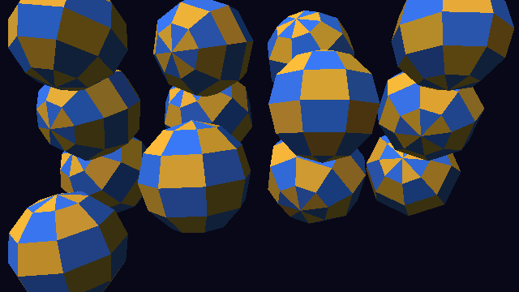

# Stress test di rendering — bm33 su Raspberry Pi Zero W

Obiettivo: capire **quanti oggetti per frame** può disegnare bm33 prima di scendere sotto
**60 fps** (16,7 ms per frame) e sotto **30 fps** (33,3 ms per frame), per sprite e
per poligoni 2D/3D, sia dal C sia attraverso l'API delle cartucce Lua (`.b33`).

> **Stato:** misurato sul Pi Zero W reale (kernel `792787f`, 2026-09-26). I valori
> QEMU sono riportati solo come controllo: QEMU non emula cache, bus di memoria né
> tempi reali.

## Metodo

- Modo video delle cartucce native: **640×360, RGB565, doppio buffer**.
- Per ogni test il carico parte da un valore iniziale e cresce del 50% a ogni passo
  (1, 2, 3, 4, 6, 9, 13, … oppure 16, 24, 36, …).
- A ogni passo si disegnano **20 frame** e si misura il **solo tempo di disegno**
  (per la parte Lua: `_update` + `_draw`), senza l'attesa del ritmo a 60 Hz.
- Ci si ferma quando un passo supera 40 ms. Le soglie a 16,7 ms e 33,3 ms si ricavano
  per **interpolazione lineare** tra i due passi a cavallo (il costo cresce in modo
  circa lineare con il numero di oggetti).
- "us/item" è la pendenza: il costo di un oggetto in più, in microsecondi.
- Ogni frame parte da `cls` (schermo intero), quindi il costo fisso di pulizia è incluso.
- I dettagli di ogni passo escono sulla seriale; lo schermo mostra la tabella finale.

## Test

| Test | Cosa disegna | Note |
|---|---|---|
| sprites 16×16 (C) | N sprite 16×16 con trasparenza, metà specchiati, in movimento | blit C con maschera |
| sprites 32×32 (C) | come sopra, 32×32 | 4× i pixel per sprite |
| triangles 2D ~170px | N triangoli pieni di circa 20 px di lato (≈170 pixel l'uno) | rasterizzatore a scanline |
| 3D spheres 96 (C) | N sfere di 96 triangoli (6×8), ruotanti, prospettiva, z-buffer, luce per faccia | circa il 40% dei triangoli è visibile (gli altri vengono scartati come facce posteriori) |
| sprites 16×16 (Lua) | come il test C, ma ogni sprite è una chiamata `spr()` da Lua con il calcolo della posizione in Lua | costo reale per una cartuccia |
| 3D spheres 96 (Lua) | come il test C, con `draw3d()` chiamato da Lua | trasformazioni e raster in C |

Per il 3D la tabella riporta il numero di sfere e, tra parentesi, i **triangoli
effettivamente disegnati** per frame.

## Pipeline 3D (software)

La GPU 3D del Pi (VideoCore IV) **non** è usata: il 3D è un rasterizzatore software
sull'ARM (`src/b33/r3d.c`).
- trasformazione per vertice in virgola mobile (VFP), camera con yaw/pitch e FOV;
- eliminazione delle facce posteriori e degli oggetti dietro la camera (senza
  clipping sul piano vicino: un triangolo che lo attraversa viene scartato);
- triangoli pieni a scanline con **z-buffer a 16 bit** (1/z), ombreggiatura piatta
  (Lambert per faccia + luce ambiente);
- nessuna texture, nessuna interpolazione del colore (Gouraud) per ora.

API per le cartucce: `mesh`, `mesh_sphere`, `mesh_cube`, `draw3d`, `camera3d`,
`light3d`, `zclear`, `tri` (vedi README).



## Risultati

**Versione del kernel:** la sigla in alto a sinistra sullo schermo (barra azzurra,
es. `bm33 1b31924`) è il commit git con cui è stato compilato il kernel. Lo stress
test esiste dalla versione `1b31924`: con una sigla diversa (es. `7044581`, che è M5)
sulla SD c'è un kernel più vecchio. Se compare `-dirty`, il kernel è stato compilato
con modifiche locali non committate.

| Misura | Versione | Data |
|---|---|---|
| Pi Zero W v1.1, 1 GHz, cache attive | `792787f` | 2026-09-26 |
| QEMU (controllo) | `1b31924` | 2026-09-26 |

> Dal kernel `6ef0a58` le cartucce disegnano in un buffer in RAM con cache, copiato
> sullo schermo una volta per frame, e lo stress test conta anche la copia: i numeri
> qui sotto (misurati prima, scrivendo direttamente nella memoria video senza cache)
> vanno rimisurati.

Numero massimo di oggetti per frame (640×360, RGB565):

| Test | **Pi 60 fps** | **Pi 30 fps** | **Pi µs/oggetto** | QEMU 60 fps | QEMU 30 fps |
|---|---:|---:|---:|---:|---:|
| sprites 16×16 (C) | **4482** | **9255** | 3,49 | 2133 | 4088 |
| sprites 32×32 (C) | **1513** | **3130** | 10,30 | 635 | 1363 |
| triangles 2D ~170px | **2594** | **5368** | 6,00 | 1340 | 2680 |
| 3D spheres 96 (C) | **31** (1195 tri) | **129** (5011 tri) | 162,88 | 16 (602 tri) | 53 (2065 tri) |
| sprites 16×16 (Lua) | **1829** | **3774** | 8,52 | 994 | 1822 |
| 3D spheres 96 (Lua) | **29** (1115 tri) | **120** (4692 tri) | 169,97 | 16 (603 tri) | 48 (1868 tri) |

Ripetibilità: una seconda esecuzione sullo stesso Pi ha dato gli stessi valori entro
±1 oggetto (es. 4481 contro 4482 sprite, 5010 contro 5011 triangoli), quindi la misura
è stabile.

### Cosa dicono i numeri del Pi

- **Sprite in C:** ~4500 sprite 16×16 a 60 fps. Il costo è quasi tutto nei pixel:
  3,5 µs per 256 pixel (~14 ns/pixel); il 32×32 ha 4× i pixel e costa 3× (10,3 µs),
  quindi la gestione del singolo sprite pesa poco e il limite è la banda verso la
  memoria video.
- **Sprite da Lua:** ~1800 a 60 fps. La differenza con il C (8,5 − 3,5 ≈ **5 µs per
  sprite**) è la logica Lua del test (calcolo della posizione) più la chiamata `spr()`.
  Per un gioco: centinaia di sprite con logica vera restano abbondantemente a 60 fps.
- **Triangoli 2D** (~170 px): ~2600 a 60 fps, 6 µs l'uno (~35 ns/pixel compresa la
  preparazione della scanline).
- **3D:** ~**1200 triangoli disegnati** a 60 fps, ~5000 a 30 fps (circa 14 µs per
  triangolo disegnato, comprese trasformazioni, facce scartate, pulizia di schermo e
  z-buffer). Da Lua il costo è quasi identico (+4%), perché tutto il lavoro 3D è in C.
  È un budget da console di fine anni '90 in software: scene low-poly a 60 fps,
  scene più ricche a 30 fps.
- **Confronto con il budget dichiarato per `.b33`** (mappa piena + 256 sprite sotto il
  25% del frame): 256 sprite 16×16 costano ~0,9 ms, ampiamente dentro.

Dati di riferimento già misurati sul Pi reale (M3–M7): riempimento 640×360 a 32 bit
2,2 ms; demo C con 64 sprite 2,7 ms per frame; Lua circa 100 ns per operazione semplice.

## Come eseguirlo sul Pi

```sh
cd ~/bm33 && git pull
make sdcard-stress               # kernel dedicato: esegue lo stress test all'avvio
sudo umount /mnt/d 2>/dev/null; sudo mount -t drvfs D: /mnt/d
cp dist/kernel.img /mnt/d/ && sync && cmp dist/kernel.img /mnt/d/kernel.img && echo "COPIA OK"
sudo umount /mnt/d
```

All'avvio, dopo il riepilogo di sistema, scorrono i sei test (circa 30–60 s in tutto)
e alla fine resta sullo schermo la tabella dei risultati: basta una foto.
Per tornare al kernel normale: `make sdcard` e ricopiare `dist/kernel.img`.
Con il cavo seriale lo stesso test si avvia dal monitor con il tasto `S`.

## Come leggere i risultati

- **C vs Lua:** la differenza tra le due righe "sprites 16×16" è il costo della logica
  Lua per sprite (calcolo della posizione + chiamata `spr`): è ciò che paga una cartuccia.
- **32×32 vs 16×16:** se il costo per sprite cresce circa 4×, il limite è il numero
  di pixel (banda verso la memoria video), non la gestione degli sprite.
- **3D:** il limite è il numero di triangoli disegnati e la loro area. Le sfere del
  test sono piccole (poche centinaia di pixel per triangolo al massimo); triangoli
  grandi costano di più.

## Possibili ottimizzazioni (dopo le misure)

- scrittura degli sprite a 32 bit (2 pixel per volta) e percorsi dedicati per i flip;
- rasterizzatore in virgola fissa con incrementi per scanline invece di divisioni;
- ridisegno solo delle zone cambiate (dirty rectangles) per i giochi a schermo fisso;
- Gouraud e texture solo se il budget lo permette;
- a lungo termine: la GPU 3D del VideoCore IV (V3D) senza sistema operativo,
  un progetto a parte.
