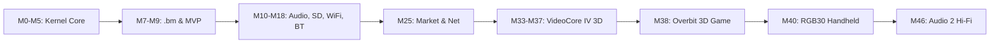

# bm Progress & Architecture Reference

This directory documents the technical progress, system architecture, and subsystem designs of **bm** (BareMetal).

bm is a bare-metal fantasy console running on ARM hardware with no underlying operating system or Linux kernel. From power-on to user input, all hardware management, graphics rasterization, sound synthesis, and scripting run directly on bare metal.

---

## Progress Overview by Subsystem

The progress documentation is organized into six core architectural domains:

| Subsystem Document | Scope & Focus Areas | Key Components |
|---|---|---|
| [**System & Hardware**](progress/system.md) | Bootstrapping, ARM architecture, interrupt handling, MMU/caching, peripherals, and storage | `start.S`, `mmu.c`, `irq.c`, DWC2 USB host, SDHCI FAT32, BCM43438 Bluetooth/WiFi |
| [**Graphics & Video**](progress/graphics.md) | Framebuffer, 2D blitter, 3D software rasterizer, VideoCore IV V3D driver, Mali GPU, and performance benchmarks | `fb.c`, `gfx16.c`, `r3d.c`, `gpu3d.c`, `v3d.c`, `mali.c`, QPU vertex/fragment shaders |
| [**Lua & Runtime**](progress/lua.md) | Lua 5.4 VM integration, cartridge lifecycle, standard APIs, `bmlib`, `bmnet`, debugger, and profiler | `runtime.c`, `third_party/lua/`, `bmlib.lua`, `bmnet.lua`, `profile.c` |
| [**Audio Engine**](progress/audio.md) | Audio 2 hi-fi synthesis engine, PolyBLEP oscillators, resonant TPT filters, stereo reverb/echo, HDMI/I2S output, and `riff` | `synth.c`, `audio.c`, `hdmi_audio.c`, `rk_audio.c`, `riff.lua`, `music.c` |
| [**Supported Platforms**](progress/platforms.md) | Target hardware profiles (Raspberry Pi Zero W / Pi 1, Pi Zero 2 W, PowKiddy RGB30) and simulation targets | `BCM2835` (ARMv6), `BCM2710A1` (ARMv7), `RK3566` (AArch64), `bmhost`, QEMU |
| [**Tools & SDK**](progress/tools.md) | On-console creative suite (SDK, Code, Pixel, Studio, Animator, Mesh, Sound), packaging scripts, AI assistant, and CI | `carts/editor/`, `carts/code/`, `carts/studio/`, `mkbm.py`, `bmres.py`, `assist.c` |

---

## High-Level Milestone Status

Development follows the roadmap defined in [`docs/ROADMAP.md`](ROADMAP.md):

### Completed Foundations
* **Bare-Metal Core (M0–M9)**: Boot from SD, MMU with 1 MB identity sections and cache enablement, 60 Hz frame synchronization, embedded Lua 5.4, 16-bit RGB565 graphics pipeline, USB DWC2 HID stack (keyboard, mouse, gamepad), and `.bm` cartridge container.
* **Console Infrastructure (M10–M32)**: SD FAT32 read/write, Bluetooth stack with DS4 support, BCM43438 WiFi with WPA2-PSK and HTTPS updates, on-console market client (`bm-market`), system-wide performance overlay, and input prompts.
* **VideoCore IV 3D Acceleration (M33–M37, bm3d 6.8)**: Full hardware 3D driver running on the VideoCore IV V3D engine via mailbox setup. Supports programmable QPU vertex and dual-thread fragment shaders, indexed primitives, depth testing, early-Z, MSAA, and texture caching.
* **Overbit & 3D Showcase (M38)**: First-person 3D shooter cartridge testing the hardware limits, featuring dynamic scaling between 1080p GPU and 640×360 ARM, automated bot training via INT8 neural networks, and UDP lockstep networking.
* **Handheld Portability (M40)**: Port to PowKiddy RGB30 (RK3566, AArch64) with unified UI, I2S audio via RK817, battery monitoring (the charger seen at once; a low-battery icon over games and tools, `battery()` / `battery_low()` in Lua: [platforms](progress/platforms.md)), and initial Mali-G52 GPU driver bring-up (bm3d 6.0–6.1).
* **Developer Tooling (R10–R14)**: Built-in `bmlib` utility library, up to 8 map layers and tile flags, 8 save slots per cartridge (`.SAV`, `.S02`–`.S08`), interactive Lua breakpoint debugger, and function-level profiler (F11 devkit mode 3).

### Active & In-Progress Tracks
* **M46 — Audio 2 (Hi-Fi Synthesis & Pattern Engine)**: PolyBLEP oscillators, resonant TPT filters, stereo FDN reverb, 42 presets, Strudel-style `riff` live-coding pattern language, and INT8 melody generator.
* **M45 — bm Write**: On-console word processor cartridge supporting formatted text, A4 pagination, controller-based predictive typing, and direct PDF export.
* **M41 — RGB30 Mali GPU & Overbit `.b16`**: Extending the Bifrost v7 GPU driver from surface clears to triangle tiling and fragment shading, enabling hardware 3D on the RGB30.
* **M43 — Sprite Stacking**: Voxel/slice-based pseudo-3D rendering directly integrated into `gfx16.c` and bm Pixel.
* **M44 — QPU Compute / Coprocessor**: Using VideoCore IV QPUs outside 3D rendering for 2D lighting, particle simulations, and audio effects.

---

## Repository Conventions & Guide

* **Primary Branch**: `bm-core` contains stable mainline development.
* **Target Platforms**: Raspberry Pi Zero W (default), Raspberry Pi 1, Raspberry Pi Zero 2 W (`make ZERO2=1`), and PowKiddy RGB30 (`make TARGET=rgb30`).
* **Documentation Index**:
  * Architecture & Progress: [`docs/progress/`](progress/)
  * Hardware Specifications: [`docs/HARDWARE.md`](HARDWARE.md)
  * Performance & Benchmarks: [`docs/PRESTAZIONI.md`](PRESTAZIONI.md), [`docs/BENCH3D.md`](BENCH3D.md), [`docs/STRESS.md`](STRESS.md)
  * 3D Driver History: [`docs/DRIVERS.md`](DRIVERS.md)
  * Game Developer API: [`docs/API.md`](API.md) (English) / [`docs/API-IT.md`](API-IT.md) (Italian)
