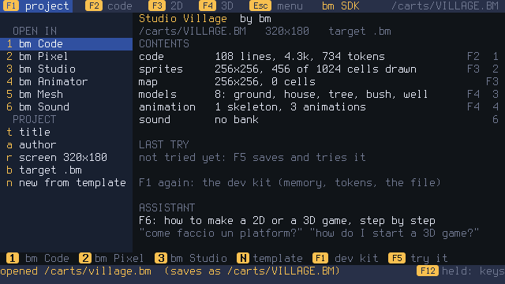
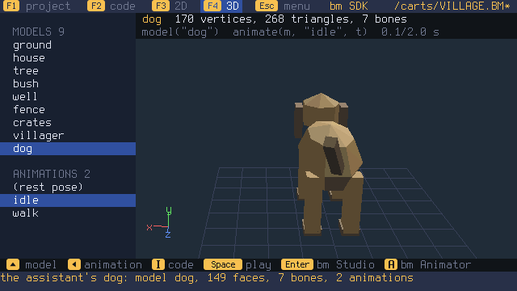
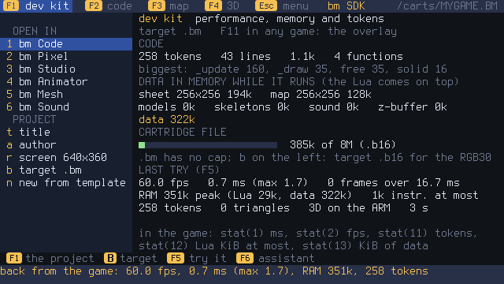

# Gli strumenti della console per le risorse dei `.bm`

Le risorse delle cartucce `.bm` (modelli 3D, scheletri e animazioni, pixel art dello
sprite sheet, mesh nel codice) si fanno **sulla console**, nella scheda **Dev**, con la
tastiera, il gamepad o il mouse (`require "bmui"`: il mouse fa quello che fanno i tasti, il
tasto destro apre un menu con i tasti della pagina): **bm SDK** (il centro del progetto), **bm Studio** (modelli 3D a
tessere), **bm Animator** (scheletri, animazioni, sprite pre-renderizzati), **bm Mesh**
(vertici e facce, anche delle mesh che il codice costruisce) e **bm Pixel** (lo sprite
sheet). Lavorano sul progetto, il `.bme` (lo aprono, lo cambiano, lo salvano al suo posto
sulla SD), non toccano il codice del gioco, la mappa e le sezioni che non conoscono, e dal
menu dell'uno si passa all'altro sullo stesso file.

Sul PC ci sono gli strumenti a riga di comando sugli stessi file: `scripts/mkbm.py --models`
(un `.glb` o un `.bm` di modelli dentro una cartuccia), `scripts/bmmesh.py`,
`scripts/bmres.py` (le risorse), `tools/bmreduce.py`, `tools/cutout2mesh.py`,
`tools/meshy2mesh.py`, `tools/local2mesh.py`, `tools/img2mesh.py`.
I file su cui lavorano gli strumenti sono **progetti** (`.bme`); un **gioco** (`.bm`) si apre
per leggerlo e prenderne i pezzi, e salvandolo se ne fa la copia modificabile (vedi *Progetti e
giochi* più sotto).

## I modelli in un gioco

```lua
local casa
function _init()
  casa = model("house")            -- una mesh, come quelle di mesh()
end
function _draw()
  cls(0x1c2030)
  zclear()
  camera3d(0, 4, -8, 0, -0.4)
  light3d(-0.4, 0.8, -0.5, 0.4)
  draw3d(casa, 0, 0, 0, 0, time() * 0.5)
end
```

- `model(nome)` (o `model(n)`, dall'1) dà la mesh, `nil` se non c'è; `models()` la
  lista dei nomi; `bounds3d(m)` il box `x0, y0, z0, x1, y1, z1` (per centrare o per le
  collisioni). Riferimento: [docs/API-IT.md](../docs/API-IT.md) ([API.md](../docs/API.md) in inglese).
- L'origine della griglia (le tre linee colorate) va nel punto `x, y, z` di `draw3d`; un
  quadretto è una unità.
- Le facce con texture usano lo sprite sheet della cartuccia: se il gioco cambia lo sheet
  con `sset`, cambiano anche i modelli.

**Sul Pi**: si copia il `.bm` in `carts/` sulla SD (o lo si manda con `tools/bm_net.py`).

**Per un gioco del repository** (costruito da `make`): si mette `models.bm` (un `.bm` con
i modelli e gli scheletri, salvato da bm Studio o bm Animator della console) o `models.glb`
in `carts/<gioco>/`; `make` lo mette nella cartuccia con `mkbm.py --models`. Se il gioco non
ha un suo `sheet.png`, lo sheet è quello di `models.bm` o del `.glb`. Esempio completo:
`carts/village` (Studio Village: le case, gli alberi e il paesano con le sue tre animazioni
stanno in `models.bm`).

## Limiti

- Un modello ha al massimo **65535 angoli** e 65535 triangoli (fino al 2026-10-05 erano 4096
  e 16384, e un kernel di prima rifiuta un modello più grande);
  la console disegna circa **1200 triangoli a 60 fps** per scena.
- Pixel pieni o trasparenti (alfa < 128 = trasparente), come per gli sprite.
- Le texture che si ripetono (uv fuori da 0..1) non ci sono: bm allunga il bordo.
- Ogni angolo segue **un** osso (niente pesi misti); 64 ossa per modello, 255 animazioni,
  1024 keyframe per animazione; un keyframe è sempre la posa intera.
- Il **margine delle texture** (0,25 px, nella sezione MESH) sposta gli angoli della
  texture di ogni faccia un po' verso l'interno, perché sul Pi la tessera accanto nello
  sheet non si veda lungo i bordi.

## Sulla console: bm SDK, il centro del progetto

**bm SDK** (`carts/editor/main.lua`, incorporato nel kernel, scheda **Dev**; da un gioco
**X** → *Open in the SDK*; dal monitor `e`) è il punto da cui parte un gioco e da cui si
raggiungono gli altri programmi della suite sullo stesso file.

<p>
  
  
  
</p>

Ha l'aspetto di bm Studio
e bm Animator (pannello a sinistra con le liste dai titoli grigi, due righe sopra la
vista con il nome in arancio, i tasti in basso, i colori di bm Mesh) e usa la loro
libreria per le liste, la vista 3D e le sezioni MESH e ANIM (`require "bm3d"`). Le pagine
con i tasti F (Y + sinistra/destra sul gamepad), Esc il menu, **F12** tenuto i tasti.

- **F1, il progetto**: a sinistra *OPEN IN* (1 bm Code, 2 bm Pixel, 3 bm Studio, 4 bm
  Animator, 5 bm Mesh, 6 bm Sound: l'SDK salva e apre il programma sullo stesso file; nel
  suo menu **Back to bm SDK** salva e torna) e *PROJECT* (t titolo, a autore, r schermo, b
  target `.bm`/`.b16`, n un modello). A destra cosa c'è nel file: righe, KiB e **token**
  del codice, le celle disegnate dello sheet, quelle della mappa, i modelli, gli
  scheletri e le animazioni, il banco di suoni; i numeri dell'ultima prova; come chiedere
  all'assistente.
- **F1 di nuovo, il dev kit**: i token e le funzioni più grandi, la memoria che i dati
  del gioco occupano mentre gira (sheet, mappa, modelli, scheletri, suoni, z-buffer: la
  stessa somma di `stat(13)`; il Lua si aggiunge), il file salvato contro gli **8 MiB**
  di un `.b16` ([docs/B16.md](../docs/B16.md) §8.5) e, con il target `.b16`, le righe che
  quel formato non avrà (`math.random`, `time()`, i file...). Dopo una prova (**F5**) i
  suoi numeri: fps, ms medi e massimi di `_update` + `_draw`, fotogrammi oltre 16,7 ms,
  la RAM massima (Lua + dati), le istruzioni del fotogramma più pesante, i triangoli e
  chi disegnava il 3D (`cart_arg().run`). Nei giochi gli stessi numeri vengono da F11
  (l'overlay: fps, ms, Lua, RAM, token) e da `stat(11)`–`stat(14)`.
- **F2, il codice**: l'editor veloce (bm Code, con le schede, è a un tasto: 1), con i
  colori della sintassi e in verde acqua le funzioni del 3D; nella riga di stato i token.
  Ctrl+G va all'errore dell'ultima prova, **F9** lo fa spiegare all'assistente.
- **F3, gli sprite**: lo sprite scelto ingrandito, lo sheet, la tavolozza (spazio
  disegna, x prende il colore, f riempie, z 8×8/16×16, Tab sceglie sullo sheet, h/v
  specchiano, u annulla); **F3 di nuovo, la mappa** (spazio mette la tessera, Backspace
  svuota, f riempie, Tab sceglie la tessera). Per tutti gli attrezzi: bm Pixel (2).
- **F4, il 3D**: i modelli del progetto in un elenco e le animazioni di quello scelto;
  il modello gira sulla griglia con l'animazione che va (su/giù il modello,
  sinistra/destra l'animazione, spazio ferma, q/e/w/s la camera, + − lo zoom); **i**
  scrive nel codice le righe per caricarlo (`model`) e disegnarlo (`animate`, `draw3d`)
  e la `camera3d` della vista; Invio, a, m aprono bm Studio, bm Animator, bm Mesh.
- **Ctrl+N, un progetto da un modello**: Empty 2D, Platform 2D (eroe, terreno, mappa con
  piattaforme), Top-down 2D (muri e monete nella mappa), Shooter 2D (nave e nemici a
  ondate), 3D scene (pavimento, cubi, palla con l'ombra, camera che segue), 3D with
  models (i modelli del progetto che girano, animati). Ognuno con il codice, gli sprite e
  la mappa che gli servono: F5 lo prova subito.
- **F6, l'assistente**: sulla pagina del progetto le **guide** per fare un gioco 2D o 3D
  passo passo (il modo `guide`: "come faccio un platform?", "how do I start a 3D game?";
  Invio mette il loro codice nel codice), nel codice le funzioni e gli esempi, sugli
  sprite una base di pixel art nella cella scelta, nel 3D un modello con lo scheletro che
  entra nel progetto (sezioni MESH e ANIM, salvate con il resto).

Il **menu** (Esc): Continue, New project (i modelli), Open, Save, Save as (nome 8.3 in
`/carts`), Build the game .bm (Ctrl+B), Try the game, Exit. Il salvataggio usa `cart_save`:
codice, sheet, mappa, copertina, suoni, modelli e scheletri.

**Progetti e giochi** (`src/bm/project.h`, `docs/API-IT.md`): tutti gli strumenti della suite
(SDK, bm Code, bm Studio, bm Animator, bm Mesh, bm Pixel, Sound) cambiano solo i **progetti**
(`.bme`); un **gioco** (`.bm`, `.b16`) lo leggono e basta. Aperto un gioco, il primo
salvataggio chiede *Save an editable copy: NOME.BME?* e da lì lo strumento lavora sulla copia
(il secondo valore di `cart_save`/`cart_write`/`cart_put_audio`); un progetto nuovo è
`GIOCO.BME`. *Build the game .bm* (`cart_build`) scrive il gioco del progetto in `/carts` e lo
sostituisce a ogni build. Nel menu di bm i progetti stanno in Dev con l'etichetta "Project".
Le controfigure dei test sul PC seguono le stesse regole (`tests/studio/project_rules.lua`). Prove: `tests/studio/sdk_host.lua` (in `make
test-studio`: ogni modello di gioco gira 400 fotogrammi sulle controfigure), QEMU
`test_editor` e `test_sdk_suite` (Studio Village: la pagina 3D, il modello
dell'assistente salvato, bm Studio e ritorno).

## Sulla console: bm Studio e bm Animator

Sulla console ci sono gli stessi due programmi, con gli stessi nomi: **bm Studio**
(`carts/studio/main.lua`, i modelli) e **bm Animator** (`carts/animator/main.lua`,
scheletri, animazioni e sprite). Sono cartucce incorporate nel kernel, nella scheda **Dev**;
da un gioco si aprono con **X** sulla copertina, **Open in bm Studio** o **Open in bm
Animator** (dal monitor i tasti `3` e `6`), e dal menu dell'uno si passa all'altro sullo
stesso file (*Open in bm Animator*, *Open in bm Studio*). Leggono e scrivono le sezioni
MESH e ANIM del `.bm` (`src/bm/bm.h`), e un gioco senza modelli può riceverne. Si usano con la tastiera o con il
gamepad (Bluetooth o USB); il mouse (M32) c'è nel menu, ma Studio e Animator non lo usano
ancora.

Le pagine si scelgono con i tasti F (o Y + sinistra/destra sul gamepad), il menu con Esc
(Y + B); tenendo premuto **F12**, o con **?**, compaiono i tasti della pagina. In tutte le
viste 3D + e − fanno lo zoom e **Alt + frecce** (sul gamepad X + croce) girano la camera.

Hanno l'aspetto delle altre app della console (bm Mesh, bm Pixel): a sinistra un pannello
con le liste, sopra la vista due righe che dicono cosa c'è e cosa si sta facendo, in basso
i tasti; le cose scelte in giallo, quella sotto il puntatore in azzurro.

**bm Studio**, F1 **build** — nel pannello a sinistra gli attrezzi, la tessera o il colore
del pennello (con lo sheet intorno) e il modello (facce, triangoli, vertici: avvisa oltre
i 1200 triangoli dei 60 fps):

- **1 blocco** e **2 tessera**: un cursore a forma di cella si
  muove con le frecce sul piano e con PgUp/PgDn in altezza, sempre rispetto alla vista
  (**q e** girano la vista di 45°, **w s** la inclinano). Spazio mette, Backspace toglie:
  due blocchi vicini non hanno parete in mezzo, e togliendone uno ricompare la parete del
  vicino; la tessera va su un lato della cella (**f**: pavimento, pareti, soffitto). **Tab**
  (o Y) apre lo sheet: tessere da 8, 16 o 32 pixel (**z**), anche **più tessere insieme**
  (**a d w s**: una porta alta due tessere si posa in un colpo), o un colore (**c**); **r**
  e **h** girano e specchiano la tessera, **x** la prende da una faccia.
- **3 select**: le frecce portano il puntatore sulla faccia più vicina in quella direzione
  sullo schermo; spazio la sceglie, **a** tutte, **c** quelle unite (un oggetto intero).
  Le facce scelte: **g** le sposta (frecce, PgUp/PgDn; Tab cambia il passo da 1 a 1/16;
  Invio le lascia lì, Esc le rimette dov'erano), **r** le gira, **t** le capovolge, **m** le
  specchia, **n** mostra l'altro lato, Invio ci mette la tessera del pennello, **u** gira la
  texture, **,** **.** dimezzano e raddoppiano, **d** (Ctrl+D) le copia e sposta la copia,
  Canc le cancella, **o** le porta in un modello nuovo.
- **4 vertex**: il puntatore va sugli angoli; spazio li sceglie, **g** li sposta (tetti,
  rampe, forme libere), **m** ne unisce più d'uno in uno.
- **5 paint**: la faccia sotto il puntatore, Invio: la sua tessera grande nel pannello, e
  si dipinge pixel per pixel (spazio; **e** trasparente, **i** prende il colore, **c** la
  tavolozza); il modello cambia mentre si dipinge. Lo sheet dipinto si salva con il modello.
- **v** cambia la vista (luce, colori piatti, fil di ferro), **b** mostra anche le facce
  viste da dietro (più scure), **z** torna al modello.

F2 **models**: i modelli del file, con il loro aspetto; **n** nuovo, **r** rinomina, **d**
duplica, Canc cancella (due volte), PgUp/PgDn cambiano l'ordine, **i** il margine delle
texture, **-** riduce i triangoli (chiede quanti; la metà per default): il riduttore del
kernel (`src/bm/decimate.c`, collasso degli spigoli con le quadriche) tiene bordi, linee di
colore e cuciture della texture, lo scheletro segue i vertici, Ctrl+Z annulla. Per
adattare un modello pesante (un `.glb` importato, un modello di meshy2mesh) ai 1200
triangoli del Pi. Sul PC fa lo stesso `tools/bmreduce.py CART.bm --faces 1200`. **m** (o
"Model from picture..." nel menu) fa un modello da un'immagine, vedi sotto. Il menu ha
anche titolo e autore della cartuccia.

**Un modello da un'immagine, sulla console.** Pagina models, **m**: tre modi.

- **cutout**: il contorno dell'immagine (sfondo trasparente, o il colore degli angoli)
  diventa un ritaglio con un po' di spessore, come una figura di carta: l'immagine davanti,
  specchiata dietro, i colori del bordo sui lati. Fatto sulla console, senza rete.
- **lathe**: il mezzo contorno tornito intorno all'asse verticale (vasi, torri, razzi,
  pedine), con l'immagine proiettata davanti. Anche questo senza rete.
- **meshy.ai**: un servizio image-to-3D neurale (il primo è [Meshy](https://www.meshy.ai),
  altri si aggiungono alla tabella in `src/net/img3d.c`): bm Studio manda l'immagine, segue
  il lavoro e prende il modello completo, visto da ogni lato.

In tutti i casi la texture va sullo sprite sheet del progetto se è ancora vuoto, altrimenti
le facce prendono i colori della texture; il modello è alto 2 blocchi e sta nei 1200
triangoli. Le immagini (`.png` o `.jpg`, un soggetto su sfondo pulito, meglio di fronte)
vanno nella cartella `pics/` della SD. Per il servizio serve anche:

1. La console collegata al WiFi (Settings > Network) e sulla SD `bm/ca.pem` (è nella
   `dist/`: i certificati per https).
2. La chiave del servizio in `bm/config.txt` sulla SD, una riga: `meshy_key=msy_...` (si
   crea su meshy.ai, Settings > API keys; i modelli costano crediti).

Con il servizio la riga di stato dice a che punto è il lavoro (uno sguardo ogni 5 secondi,
un paio di minuti in tutto; Esc lo abbandona); senza chiave o senza rete il messaggio dice
cosa manca. In ogni caso alla fine il modello compare nella lista con il nome dell'immagine
e Ctrl+S lo salva. Sul PC fanno lo stesso `tools/cutout2mesh.py hero.png -o hero.bm`
(`--lathe`, `--depth`, `--segments`) e `tools/meshy2mesh.py` (vedi sotto).

**Senza chiave né cloud, sul PC: `tools/local2mesh.py`.** Gli stessi modelli con una rete
image-to-3D aperta che gira sul tuo computer: TripoSR (veloce, una scheda NVIDIA da 6 GB
o la sola CPU, lento) o Hunyuan3D 2 (meglio, NVIDIA da 12 GB in su). Una volta:
`tools/local2mesh.py --install triposr` (clona il programma in `~/.bm/local3d`, fa un venv
con PyTorch; i pesi arrivano da huggingface.co al primo uso, qualche GB). Poi
`tools/local2mesh.py hero.png -o hero.bm` (`--backend hunyuan3d`, `--faces`, `--height`,
`--flat`, `--name`): il `.glb` del modello passa per la stessa conversione di meshy2mesh,
texture sullo sheet e riduttore. Con `--backend command --command "tool {image} --out
{out}"` va qualunque altro strumento che scriva un `.glb`. `--check` dice cosa c'è.

**bm Animator**:

- F1 **play**: il player. I modelli in una lista, con vertici, triangoli e ossa; la camera
  gira da sola (a d w s per girarla a mano). Le animazioni si scelgono con
  sinistra/destra e partono con spazio; `,` e `.` vanno avanti e indietro di un
  fotogramma, `<` e `>` cambiano la velocità, **k** mostra lo scheletro, **b** mescola
  l'animazione con la successiva (25, 50, 75 %: la stessa `animate()` dei giochi).
- F2 **rig**: **n** fa lo scheletro (un osso, root, dal fondo del modello) e poi aggiunge
  ossa figlie di quella scelta; su/giù sceglie l'osso, **w a s d r f** spostano la sua coda
  (o la testa, con Tab) di 1/8 (maiuscole: 1/32): le giunture nello stesso punto si
  muovono insieme. **m** specchia l'osso e i suoi figli dall'altra parte (nomi `.L` / `.R`,
  anche nelle animazioni), Invio lo rinomina, **p** sceglie il padre, x lo cancella. La
  pelle: **k** dà ogni faccia all'osso più vicino (parti rigide), **K** ogni angolo
  (il modello si stira alle giunture); **v** mostra le facce coi colori delle ossa e le fa
  scegliere col puntatore (spazio, **c** le unite), **a** le dà all'osso (PgUp/PgDn).
- F3 **animate**: **n** fa un'animazione; su/giù sceglie l'osso, sinistra/destra il
  fotogramma (12 al secondo, come bm Animator). w/s, a/d, q/e girano l'osso di 15° intorno
  a x, y, z (maiuscole: 5°), con **g** lo spostano: ogni giro è un keyframe in quel punto.
  **k** aggiunge un keyframe, x lo toglie, **,** **.** vanno al keyframe prima e dopo,
  **(** **)** lo spostano di un fotogramma; **c v** copiano e incollano la posa, **r** rimette
  l'osso a riposo, **m** specchia la posa; **o** mostra le ossa dei keyframe prima e dopo
  (onion skin); **l** ciclo sì/no, **i** linear / smooth / step, `<` `>` la durata. A
  sinistra le animazioni: PgUp/PgDn le cambiano, **n** nuova, Ctrl+D duplica, Invio
  rinomina, Backspace due volte cancella.
- F4 **sprites**: l'animazione disegnata in sprite dal motore 3D della console, per i
  giochi in 2D: fotogrammi, misura (16…128), direzioni (1, 2, 4, 8), quanto dall'alto,
  camera piatta o in prospettiva, luce, contorno, colori ridotti (32, 16, 8), riempimento;
  l'anteprima gira tra le direzioni. Invio mette la griglia nello sprite sheet (sotto
  quello che c'è, allargandolo se serve) e mostra il codice `sspr()` per disegnarla.

Il **menu** apre i `.bm` della SD, salva (Ctrl+S, o *Save as* con un nome 8.3 in
`/carts`), **prova il gioco** (F5: si gioca il file salvato, poi si torna nella stessa
pagina); bm Studio fa anche un progetto nuovo (con lo sheet di tessere iniziale di bm Studio
e il codice del visualizzatore dei modelli). `[` e `]` (o Y + su/giù) cambiano modello.
Ctrl+Z e Ctrl+Y (Y + A sul gamepad) annullano e rifanno, anche i pixel dipinti e gli
sprite messi nello sheet.

Come lavorano: i modelli e gli scheletri sono tabelle Lua; a ogni modifica la cartuccia
riscrive la parte di quel modello delle sezioni MESH e ANIM (`string.pack`, il formato di
`src/bm/bm.h`) e le passa al kernel con `cart_data()`, che le controlla: `model()`,
`animate()` e `bone3d()` disegnano e muovono sempre quello che verrà salvato. Il codice
comune ai due programmi (formato, progetto, annulla, menu, schede, il puntatore della
tastiera) è la libreria del kernel `src/script/bm3d.lua` (`require "bm3d"`). Salvano con
`cart_write`: nel file cambiano solo MESH e ANIM (e lo sheet, se è stato dipinto o ha
ricevuto sprite); un `.bm` aperto e salvato senza modifiche resta uguale byte per byte.

Un `.glb` entra in una cartuccia dal PC con `scripts/mkbm.py --models` o
`tools/meshy2mesh.py --glb`; ogni angolo segue un osso (niente pesi misti) e un keyframe è
la posa intera.

## Sulla console: bm Mesh

**bm Mesh** è l'editor delle mesh, incorporato nel kernel (`carts/mesh/main.lua`): scheda
**Dev**, oppure **X** sulla copertina di un gioco → **Open in bm Mesh** (dal monitor, il
tasto `4`). Legge tre tipi di mesh di un `.bm`, segnati nella lista con una lettera:

- **M**, i **modelli** della sezione MESH (quelli di bm Studio, con lo scheletro di bm
  Animator se ce l'hanno): nel gioco `model("nome")`;
- **C**, le mesh **nel codice** scritte da bm Mesh: funzioni `mesh_nome()` alla fine di
  `main.lua`, tra le righe `-- [bm Mesh begin]` e `-- [bm Mesh end]`; nel gioco
  `local m = mesh_nome()` (in `_init` o dopo) e poi `draw3d(m, ...)`;
- **G**, le mesh che il **codice del gioco** costruisce con `mesh()`, `mesh_sphere()` e
  `mesh_cube()`, come le navi e gli anelli di Astro Wing. Il kernel le trova eseguendo il
  codice a parte (`cart_meshes()`: niente file, schermo o suono, un limite di istruzioni)
  e dà a ciascuna il nome della variabile che la tiene (`M.ship` → `ship`).

Due pagine (F1 lista, F2 modifica; sul gamepad Y + sinistra/destra) e il menu con Esc;
tenendo premuto **F12**, o con **?**, compaiono i tasti.

- **F1, la lista**: su/giù sceglie la mesh, che gira in anteprima con vertici, triangoli e
  scheletro. **m** la copia come **modello** (da mesh a modello), **c** come **codice** (da
  modello a mesh: `mesh_nome()`), **r** rinomina, **d** duplica (un modello con lo
  scheletro), **Del** due volte cancella, **n** fa un modello nuovo (un cubo; con F3 anche
  piano e sfera). Le mesh del gioco non si rinominano né si cancellano: è il suo codice
  che le fa (bm Code lo modifica).
- **F2, la modifica**: un **puntatore** (frecce, più veloce tenendo premuto; sul gamepad la
  croce) indica il vertice o la faccia sotto di sé (**Tab** cambia tra vertici e facce;
  **n** e **b** lo portano sul successivo o sul precedente, anche dietro). **Spazio**
  aggiunge o toglie dalla scelta, **Invio** sceglie solo quello, **a** tutto o niente,
  **l** tutto quello che è collegato. Poi:
  - **g** sposta, **r** ruota, **t** scala: le frecce e PgUp/PgDn cambiano il valore
    (sinistra/destra e PgUp/PgDn sui due assi della vista, su/giù in altezza; **x y z**
    solo su quell'asse, **n** lungo la normale), `,` e `.` il passo (0,01–1; 1–90°;
    ×1,01–2), **Invio** conferma, **Esc** annulla;
  - **x** estrude le facce scelte (poi si spostano lungo la normale), **d** le duplica,
    **m** specchia la scelta (sinistra-destra sullo schermo), **M** la copia dall'altra
    parte dello 0 (per i modelli simmetrici: i vertici sullo 0 restano in comune);
  - **j** fa una faccia sui 3 o 4 vertici scelti (nell'ordine, verso la camera), **k**
    unisce i vertici scelti in uno, **K** salda quelli nello stesso punto (con il flag 4
    di `draw3d` le facce intorno sembrano lisce), **u** divide ogni faccia in 4, **i** le
    gira, **Del** cancella;
  - **p** colora le facce, **o** prende il colore dalla faccia, **c** la tavolozza;
  - la vista: q e girano, w s inclinano, + − zoom, **f** inquadra la scelta, 1 3 7 0 le
    viste dritte; sul gamepad X + croce. Ctrl+Z e Ctrl+Y annullano e rifanno.

  Modificare una mesh **G** ne fa prima una copia come modello (il codice del gioco non si
  riscrive): il gioco la usa con `model("nome")`.

Il **menu** apre un altro `.bm`, salva (Ctrl+S) o salva come (nome 8.3 in `/carts`) e
**prova il gioco** (F5: si torna nella stessa pagina). Il salvataggio usa
`cart_write(path, {sections = {[8] = MESH, [9] = ANIM}, lua = ...})`: cambiano solo i
modelli e il blocco di bm Mesh nel codice; sprite sheet, mappa, copertina, banco di suoni
e il resto del codice restano byte per byte. Un modello con lo scheletro lo tiene: l'osso
di ogni vertice segue i vertici aggiunti (quello del vertice da cui vengono) e tolti, e
ossa e animazioni restano quelle di bm Animator.

Compatibile con le altre app: i modelli sono quelli che leggono e scrivono bm Studio, bm
Animator, `mkbm.py --models` e il kernel; le mesh nel codice hanno il formato
delle tabelle di `mesh()` (vertici, poi `a, b, c, colore` con `-1` per la texture, poi
le coordinate dello sheet) e si aprono in bm Code come il resto del codice.

## Sulla console: bm Pixel

**bm Pixel** è l'editor della pixel art, incorporato nel kernel (`carts/pixel/main.lua`):
scheda **Dev**, oppure **X** sulla copertina di un gioco → **Open in bm Pixel** (dal monitor,
il tasto `5`). Lavora sullo **sprite sheet** del `.bm`, lo stesso che usano i giochi
(`spr`, `sspr`, `map`), l'SDK e bm Studio (le texture dei modelli). Tre pagine
(F1–F3, sul gamepad Y + sinistra/destra), il menu con Esc; tenendo premuto **F12**, o con
**?**, compaiono i tasti; **Tab** (sul gamepad X) apre l'elenco dei comandi della pagina.

- **F1, il disegno**: lo sprite scelto, ingrandito (8×8, 16×16, 32×32, 64×64 o 128×128
  pixel: **z** cambia la misura, PgUp e PgDn passano allo sprite prima e dopo), con la
  griglia (**t**). Un puntatore si muove con le frecce (o la croce) e **spazio** (o A)
  usa l'attrezzo; tenendo premuto spazio la matita traccia una linea.
  - **b** matita, **e** gomma, **g** riempimento, **i** il colore di un pixel (un colore
    nuovo entra nella tavolozza), **l** linea, **u**/**U** rettangolo vuoto/pieno, **o**/**O**
    ovale vuoto/pieno, **m** selezione: per linee, rettangoli, ovali e selezioni lo spazio
    fissa un angolo, le frecce portano all'altro, lo spazio di nuovo disegna.
  - Con una selezione (o tutto lo sprite): Ctrl+C copia, Ctrl+X taglia, Ctrl+V incolla
    (il blocco galleggia: si sposta con le frecce e si posa con spazio o Invio; i suoi
    pixel trasparenti lasciano quello che c'è sotto), **Invio** solleva la selezione per
    spostarla, **h**/**v** specchiano, **r** gira di un quarto, Canc cancella;
    Shift+**w a s d** fanno scorrere lo sprite di un pixel (quello che esce rientra
    dall'altra parte).
  - **y** disegna a specchio (sinistra-destra), **,** e **.** cambiano colore, **x** torna
    al colore di prima, **1**–**9**, **0** i primi dieci; il colore 0 è il trasparente.
  - **Animazione**: lo sprite e quelli che lo seguono nello sheet sono i fotogrammi
    (**+**/**−** quanti, **<**/**>** la velocità, **p** ferma o riparte): il riquadro a destra
    li fa girare, accanto allo sprite alla misura vera. **k** è l'onion skin: il fotogramma
    prima si vede a puntini sotto i pixel trasparenti.
  - **F6**: l'assistente (M30) disegna la base di uno sprite da una parola ("slime",
    "moneta", "astronave"…) con i colori della tavolozza; galleggia come un incollato.
- **F2, lo sheet**: lo sheet intero (zoom con + e −), le frecce scelgono lo sprite (nella
  misura scelta), Invio lo disegna; Ctrl+C e Ctrl+V copiano uno sprite in un altro posto,
  Canc lo svuota, **R** cambia la misura dello sheet (multipli di 8 fino a 4096: quello che
  ci sta resta). In alto il numero dello sprite e la chiamata `spr()` che lo disegna.
- **F3, la tavolozza**: fino a 256 colori. Frecce e Invio scelgono il colore con cui
  disegnare, **e** lo modifica (R, G e B con le frecce, < e > di uno; accanto il colore come
  lo mostra la console, in RGB565), **a** ne aggiunge uno, Canc lo toglie, **[** e **]** lo
  spostano, **s** ordina per tinta, **f** prende i colori usati nello sheet, **1** e **2**
  mettono le tavolozze dell'SDK e di bm Studio; **x** (**X**) cambia il colore con cui si
  disegna in quello scelto, in tutto lo sprite (in tutto lo sheet).

Il **menu** apre un altro `.bm`, fa uno **sheet nuovo** (256×256; salvandolo con *Save as*
diventa una cartuccia con un codice che mostra lo sheet), salva (Ctrl+S), salva come,
**prova il gioco** (F5: si torna nella stessa pagina), cambia la misura dello sheet.
Ctrl+Z e Ctrl+Y (Y + A sul gamepad) annullano e rifanno. Per ogni file si ricorda lo
sprite, la misura, l'animazione e la pagina.

Il salvataggio usa `cart_write(path, {sheet = true, palette = ...})`: nel file cambia solo
lo sheet (codice, mappa, copertina, suoni, modelli e scheletri restano byte per byte, e un
file con il nome lungo lo tiene). Lo sheet diventa una sezione **SHEET8** quando ha al più
256 colori, con la tavolozza di bm Pixel per prima: riaprendo il file torna la stessa
tavolozza, e la leggono anche l'SDK, bm Studio, bm Animator, `mkbm.py` e i giochi. La
console tiene 16 bit per pixel (RGB565): un pixel che non è stato ridisegnato tiene i 24 bit
che aveva nel file, uno ridisegnato prende quelli del colore
della tavolozza. Anche gli sheet grandi si aprono (quello di Titan Clash, 2048×3448, parte
rimpicciolito a 1/4); scriverli richiede qualche secondo, e intanto lo schermo dice
"saving ...".

## Test

```sh
make test-studio      # bm Studio, bm Animator, bm Mesh, bm Pixel e l'SDK della console sul PC, i loro file riletti da Python e dal kernel
```

`make test` comprende `test-studio` e, in QEMU, `test_models`, `test_sdk_keeps_models`,
`test_village` e `test_animation` (un braccio che si alza sulla console emulata).

bm Studio e bm Animator della console hanno un banco di prova sul PC
(`tests/studio/tools3d_host.lua`, dentro `make test-studio`, con il Lua 5.4 della console):
le API di bm sostituite (una cartella fa da SD; i disegni controllano i loro argomenti, i
tasti chip i loro nomi), i tasti e il gamepad simulati, e il percorso intero: bm Studio
sul villaggio, blocchi, tessere (anche più insieme), selezione e spostamenti, vertici,
pittura, viste, modelli, annulla, salvataggio e riapertura; poi bm Animator sullo stesso
file (`cart_tool`): ossa, specchio, nomi, padre, pelle, keyframe, onion, animazioni,
sprite nello sheet, salvataggio. I file sono riletti da Python
(`tests/studio/check_files.py`: le facce del blocco girate verso fuori, la tessera rossa sul
pavimento e quella sulla parete, lo scheletro e l'animazione) e dal parser del kernel
(`test_bm`). In QEMU, `test_studio_animator` apre il villaggio in bm Studio dalle opzioni
del gioco, prova gli attrezzi, costruisce, salva, prova il gioco, passa a bm Animator,
anima, salva e mette gli sprite del paesano nello sheet.

bm Mesh ha il suo banco di prova sul PC (`tests/studio/mesh_host.lua`, in `make
test-studio`): `cart_meshes()` sostituito da un `load` del codice del gioco con le stesse
regole del kernel, e il percorso intero (le 13 mesh di Astro Wing, mesh → modello uguale a
quello che il codice dà a `mesh()`, mesh → codice che rieseguito dà le stesse mesh,
spostamenti, annulla, suddivisione, specchio, facce nuove, unione, colore, estrusione,
duplicazione, il paesano con lo scheletro dopo vertici spostati e cancellati, salva come).
I file che scrive sono riletti da `check_files.py`, da `bmmesh.py` e dal kernel
(`test_meshcap`: ogni scheletro corrisponde al suo modello). `test_meshcap` prova anche la
cattura vera (`src/bm/meshcap.c`) su Astro Wing, Texture Room e Chaos Kitchen. In QEMU,
`test_mesh` apre Astro Wing dalle opzioni, copia la nave come modello, ne sposta i vertici,
la copia come codice e salva.

bm Pixel ha il suo banco di prova sul PC (`tests/studio/pixel_host.lua`, in `make
test-studio`): lo sheet in una tabella con i colori come li tiene il kernel, `cart_write`
che lo scrive come lui, e tutti gli attrezzi (matita e tratto, linea, rettangolo, ovale,
riempimento, contagocce, specchio, selezione, copia, incolla, sollevare e spostare,
specchiare, girare, far scorrere, annulla e rifai, l'assistente, la tavolozza, lo sheet più
alto, salva, riapri, sheet nuovo, prova il gioco). I file sono riletti da `check_files.py`
(i pixel non ridisegnati con i loro 24 bit, la tavolozza, modelli e scheletri intatti) e
dal kernel (`test_meshcap`); `test_bm` prova il packer SHEET8 del kernel, lo sheet al posto
del vecchio in `bm_rewrite_with` e lo `sspr` ingrandito. In QEMU, `test_pixel` apre Studio
Village dalle opzioni, disegna e salva: nel file cambiano solo i pixel disegnati, gli altri
restano identici byte per byte; `test_pixel_big` fa lo stesso con lo sheet di Titan Clash
(2048×3448): cambia un pixel solo e la tavolozza resta quella.

## Struttura

```
carts/editor/main.lua        bm SDK, il centro del progetto (incorporato nel kernel, scheda Dev)
carts/studio/main.lua        bm Studio (incorporato nel kernel, scheda Dev)
carts/animator/main.lua      bm Animator (incorporato nel kernel, scheda Dev)
src/script/bm3d.lua          il codice comune ai due (require "bm3d")
carts/mesh/main.lua          bm Mesh, l'editor delle mesh (incorporato nel kernel, scheda Dev)
src/bm/meshcap.c             cart_meshes(): le mesh che il codice di un .bm costruisce
carts/pixel/main.lua         bm Pixel, l'editor della pixel art (incorporato nel kernel, scheda Dev)
scripts/bmmesh.py            MESH, ANIM e .glb per mkbm.py
tests/studio/tools3d_host.lua    bm Studio e bm Animator sul PC, con le API di bm sostituite
tests/studio/mesh_host.lua       bm Mesh sul PC
tests/studio/pixel_host.lua      bm Pixel sul PC
tests/studio/sdk_host.lua        il bm SDK sul PC (ogni modello di gioco gira 400 fotogrammi)
tests/studio/check_files.py      i loro file riletti dal Python della build
tests/bm/test_meshcap.c          la cattura sulle cartucce vere
```
